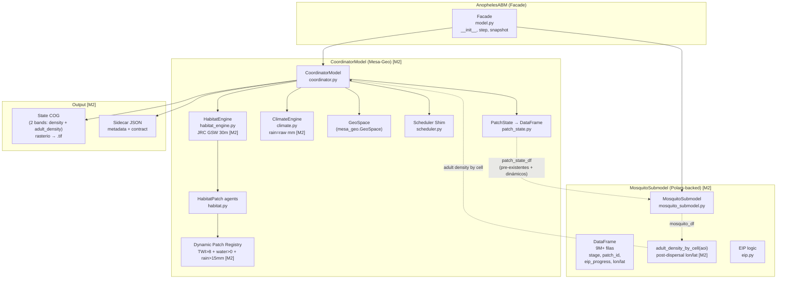
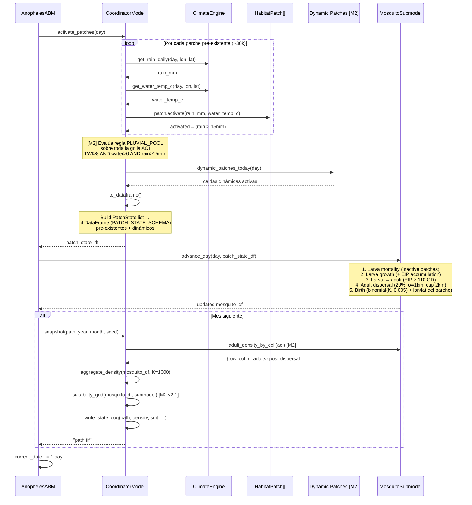
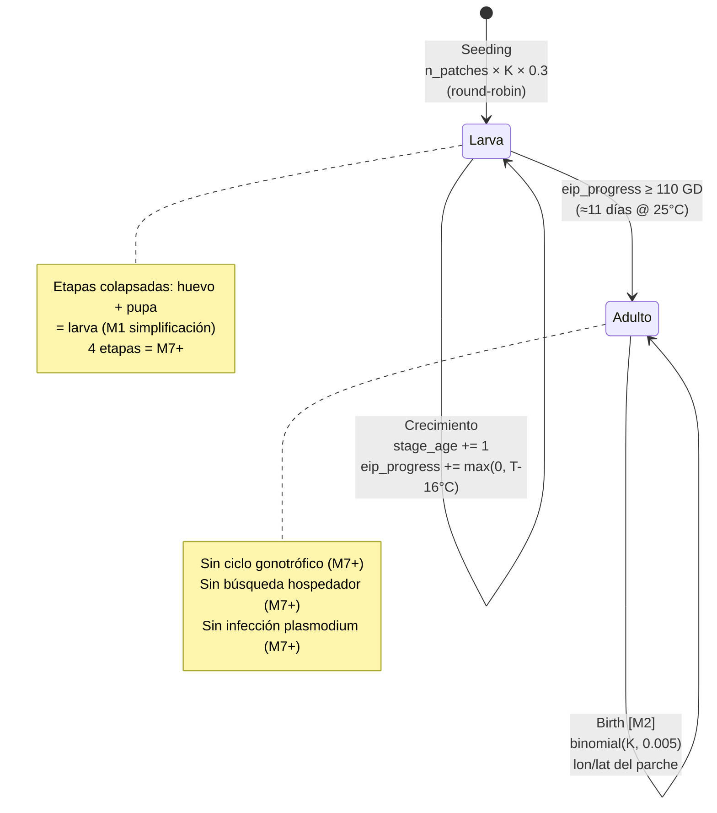
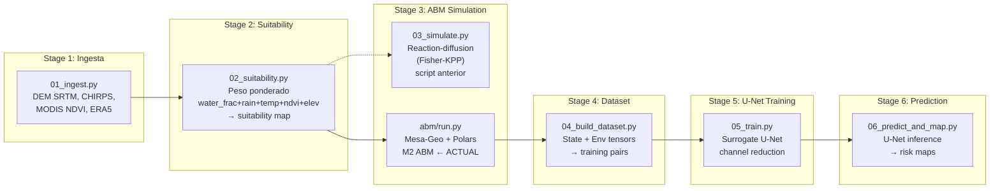
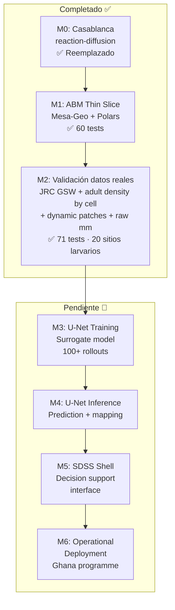
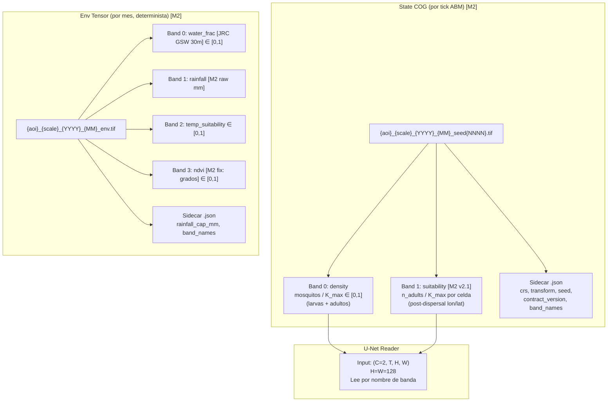

# MalariaSentinel ABM — Estado y Arquitectura

> Generado: 2026-07-14 · Versión ABM: **v0.5.0** (M2 combined) · Tests: **71/71 ✅**

---

## 1. Arquitectura actual del ABM (M2 combined — JRC GSW + adult density by cell + dynamic patches)

El ABM se divide en **dos capas** comunicadas por un DataFrame Polars. Los cambios M2 combined se marcan con **[M2]**:

**Cambios M2 combined (commits `10c0773`, `da2e741`, `a671bda`):**
- **JRC GSW** reemplaza a WorldCover como capa de agua (`build_env.py` ahora llama `load_jrc_gsw_water_frac`). JRC GSW 30m captura cuerpos de agua pequeños (charcas, arroyos) que WorldCover 10m anual diluye.
- **C1 — Adult density by cell**: la banda de suitability del COG ahora es `n_adults / K_max` por celda, calculada desde la posición **post-dispersal** de cada adulto (`lon/lat` → `rasterio.transform.rowcol`), no desde el `patch_id` de origen.
- **C2 — Dynamic patches**: los parches ahora son la **unión** de parches pre-existentes (del gpkg) y celdas que satisfacen la regla PLUVIAL_POOL hoy (`TWI > 8 AND water_frac > 0 AND rain_24h > 15mm`). Los parches dinámicos obtienen `patch_id` estable en su primera aparición y se retienen (site fidelity).
- **Rainfall raw mm**: la banda de rainfall del env tensor ahora guarda mm/mes crudos (no normalizados por P95), porque el ABM compara contra `RAIN_THRESHOLD_MM = 15` para activar parches.
- **MODIS fix**: conversión Sinusoidal→WGS84 ahora retorna grados (no radianes).

**Bloques del diagrama:**

#### AnophelesABM (Facade) — `model.py`

Punto de entrada único del ABM. Expone la misma API que el M1.4 (`__init__`, `step`, `snapshot`) para que `run.py` y los tests no necesiten cambios. Internamente solo orquesta: llama al Coordinator en orden y le pasa el DataFrame de estado al submodel. No contiene lógica de dominio — es un delegador puro.

---

#### CoordinatorModel (Mesa-Geo) — `coordinator.py`

Capa espacial del ABM. Es un `mesa.Model` que posee y gestiona todo lo relacionado con el espacio geográfico. **[M2]** Ahora gestiona también los parches dinámicos y la densidad de adultos por celda.

Cada día ejecuta 3 tareas:

1. **Activar parches** — Consulta el clima para cada parche pre-existente y decide si está activo (rain > 15mm). **[M2]** Además, evalúa la regla PLUVIAL_POOL sobre toda la grilla del AOI para detectar celdas dinámicas.
2. **Materializar estado** — Convierte el estado de todos los parches (pre-existentes + dinámicos) en un DataFrame Polars (`patch_state_df`) con el esquema `PATCH_STATE_SCHEMA`.
3. **Escribir salida** — Al final del mes, agrega la densidad de mosquitos por celda y escribe el COG de 2 bandas. **[M2]** La banda de suitability ahora es `n_adults / K_max` por celda (post-dispersal), no el mapa binario v1.

También construye el **cell lookup** (`_cell_lookup`) en `__init__`: un diccionario `{patch_id: (row, col)}` que mapea cada parche a su celda en la grilla del AOI.

**[M2] Parches dinámicos** (`_dynamic_patch_registry`): Un diccionario `{(row, col): patch_id}` que asigna IDs estables a celdas que satisfacen la regla PLUVIAL_POOL. Los parches pre-existentes conservan su ID original; los nuevos obtienen IDs secuenciales a partir de `len(habitat_engine.patches)`. Los parches que dejan de satisfacer la regla NO se eliminan (site fidelity) — simplemente no aparecen en el DataFrame del día, pero reaparecen automáticamente si la regla se cumple de nuevo.

**[M2] suitability_grid** ahora tiene dos paths:
- **v1 (backward-compat)**: 1.0 si el parche está activo, 0.0 si no. Se usa cuando no se pasa `mosquito_df`.
- **v2 (M2 combined, C1)**: Densidad de adultos por celda desde `submodel.adult_density_by_cell(aoi)`, que usa la posición post-dispersal de cada adulto. Se activa cuando se pasan `mosquito_df` y `submodel`.

##### HabitatEngine — `habitat_engine.py`

Responsable de convertir el **GeoDataFrame de hábitats** (un `.gpkg` generado por `scripts/build_env.py`) en **agentes `HabitatPatch`** que Mesa-Geo puede gestionar.

- **Entrada**: Un GeoDataFrame con columnas `hab_type`, `twi_value`, `K`, `row`, `col` y geometría Point. **[M2]** El gpkg ahora usa **JRC GSW 30m** como capa de agua (antes era WorldCover 10m). JRC GSW captura charcas y arroyos pequeños que WorldCover anual diluye, restaurando la detección de parches en los 20 sitios larvarios de validación.
- **Proceso**: `materialise(model)` itera por cada fila, filtra solo `PLUVIAL_POOL` (el único tipo activo en M1), crea un `HabitatPatch` y lo registra en el scheduler del modelo.
- **Resultado**: Una lista `self.patches` con ~30k agentes de hábitat, cada uno con su geometría, capacidad K y valor TWI.
- **Método auxiliar**: `from_gpkg(aoi, path)` carga directamente desde un archivo `.gpkg` en disco.

##### ClimateEngine — `climate.py`

Fachada sobre el **tensor env** de 4 bandas (rain, temp, water_frac, ndvi). Provee dos niveles de acceso:

- **Lookups por punto** (`get_rain_daily`, `get_water_temp_c`, `get_water_frac`, `get_ndvi`): Devuelven un float para una coordenada (lon, lat) concreta. Se usan en `activate_patches()` para evaluar si cada parche individual está activo. Para el tensor sintético (M1), son constantes por celda; para datos reales (M2+), serán lookups nearest-neighbor sobre xarray DataArrays.

- **Accessors de grilla** (`rain_daily_grid`, `temp_suitability_grid`, `water_frac_grid`, `ndvi_grid`): Devuelven la grilla completa `(H, W)` como numpy array. Se usan para el suitability grid del COG y para la evaluación de parches dinámicos.

- **[M2] `env.get("twi")`**: La ClimateEngine ahora también accede al grid TWI (Topographic Wetness Index) desde el env dict, necesario para la regla de parches dinámicos (`TWI > 8`).

- **Soporte dual**: Acepta tanto callables `f(date, lon, lat) → float` (sintético) como arrays/xarray DataArrays (real).

- **[M2] Rainfall**: La banda de rainfall del env tensor ahora es **mm/mes crudos** (antes estaba normalizado por P95 a [0,1]). El ABM compara `rain_daily` contra `RAIN_THRESHOLD_MM = 15` para activar parches; con valores normalizados el umbral nunca se cruzaba. La normalización la hace `suitability_from_stack` al consumir el tensor.

##### GeoSpace — `mesa_geo.GeoSpace`

Contenedor espacial de Mesa-Geo. En M1.5 funciona como **holder de CRS** — se instancia con `GeoSpace(crs="EPSG:4326")` y los parches se registran en él, pero el **índice espacial no se usa activamente** porque las operaciones de proximidad (dispersión) se hacen sobre el DataFrame de mosquitos, no sobre el GeoSpace. Se mantiene por compatibilidad con el API de Mesa-Geo y por si se necesita en M2+ para queries espaciales.

##### HabitatPatch — `habitat.py`

Cada parche es un **`GeoAgent`** (subclase de `mesa_geo.geoagent.GeoAgent`). Representa una **charca pluvial** (PLUVIAL_POOL) con:

- **Propiedades de estado**: `activated` (bool), `rain_24h` (float), `water_temp_c` (float), `twi_value` (float), `K` (int, capacidad máxima).
- **`activate(rain_24h, water_temp_c)`** — Evalúa la regla de activación: `activated = rain_24h > 15mm`. Se llama una vez por día desde `coordinator.activate_patches()`.
- **[M2] Regla PLUVIAL_POOL extendida**: Además de la activación por lluvia, los parches dinámicos se evalúan con `TWI > 8 AND water_frac > 0 AND rain_24h > 15mm` sobre toda la grilla del AOI (no solo los parches pre-existentes).
- **`to_patch_state(patch_id, row, col, ...)`** — Devuelve un registro `PatchState` con el estado actual del parche. Es el punto de unión entre el mundo Mesa-Geo (agentes) y el mundo Polars (DataFrame del submodel).
- **`mortality(N, density_dep=True)`** — Mortalidad denso-dependiente (Beverton-Holt): `survival = 0.95 × K / (K + 0.05 × max(0, N-K))`. Solo se usa en M1 como referencia; el submodel tiene su propia mortalidad vectorizada.
- **`produce_adults(N, model)`** — Producción de adultos: pupation probability = `clip((T - 18) / 14, 0, 1)`. También de referencia; el submodel vectoriza esto.
- **`step()`** — No-op. Se mantiene por contrato del scheduler.

##### Scheduler Shim — `scheduler.py`

Reemplazo local de `mesa.time.RandomActivationByType`, eliminado en Mesa 3.5.1. reproduce la interfaz del scheduler antiguo:

- **`add(agent, type_key)`** — Registra un agente bajo un tipo (ej: `HabitatPatch`).
- **`remove(agent, type_key)`** — Elimina un agente de su bucket.
- **`step()`** — Baraja los agentes de cada tipo con un seed derivado de `model.rng` (numpy Generator) y llama a `.step()` de cada uno. El barajado asegura que el orden de ejecución no sea determinista por construcción.
- **`counts()`** — Devuelve `{tipo: cantidad}` para introspección.
- **`get(type_key, index)`** — Acceso directo al i-ésimo agente de un tipo.

Se necesita porque el ABM registra `HabitatPatch` en el scheduler (para que `model.schedule.agents_by_type` funcione en tests que lo inspeccionan), pero los mosquitos ya no son agentes individuales — son filas de un DataFrame.

##### PatchState → DataFrame — `patch_state.py`

El **puente de datos** entre Coordinator y Submodel:

- **`PatchState`** — Dataclass frozen con 7 campos: `patch_id`, `row`, `col`, `activated`, `rain_d`, `temp_d`, `water_frac`. Es el registro Python que `HabitatPatch.to_patch_state()` devuelve.
- **`PATCH_STATE_SCHEMA`** — Diccionario de esquema Polars que define los tipos exactos de cada columna (Int64, Int32, Boolean, Float32). Tanto el coordinator como el submodel importan este schema para garantizar que sus DataFrames son compatibles.
- **`patch_states_to_dataframe(states)`** — Convierte una lista de `PatchState` en un `pl.DataFrame` con el schema fijo. Es el paso final del coordinator antes de pasar el DataFrame al submodel.
- **[M2]** El DataFrame ahora incluye **parches dinámicos** (celdas que satisfacen `TWI > 8 AND water_frac > 0 AND rain_24h > 15mm` hoy), no solo los pre-existentes del gpkg. Los parches dinámicos tienen `activated=True` por construcción (ya pasaron el filtro).

**Flujo completo de los datos del parche**:
```
gpkg → HabitatEngine.materialise() → HabitatPatch agents (pre-existentes)
  ↓ (activate)
HabitatPatch.activate(rain, temp) → patch.activated = True/False
  ↓ (dynamic_patches_today)
Celda cumple TWI>8 + water>0 + rain>15? → parche dinámico nuevo
  ↓ (to_patch_state + patch_states_to_dataframe)
[PatchState, PatchState, ...] → pl.DataFrame (PATCH_STATE_SCHEMA)
  ↓ (pass to submodel)
MosquitoSubmodel.advance_day(day, patch_state_df)
```

---

#### MosquitoSubmodel (Polars-backed) — `mosquito_submodel.py`

Capa de población. En lugar de crear un agente Python por mosquito (como hacía el M1.4), almacena **toda la población como filas de un `polars.DataFrame`**. Esto permite operaciones vectorizadas que procesan millones de filas en paralelo usando SIMD.

**¿Por qué Polars y no Mesa-frames?** El paquete `mesa-frames==0.1.0a0` tiene un pin duro en `numpy~=1.26` que choca con el `numpy>=2.5` del proyecto (requerido por torch, rioxarray, etc.). En su lugar, se usa `mesa.Model` como host y Polars directamente — que es exactamente lo que `mesa-frames` hace internamente, sin el API de masking/select que no necesitamos.

**Parámetros de población** (M2):
- `K_MAX = 1000` — capacidad máxima por parche
- `init_frac = 0.3` — se siembra el 30% de K en cada parche
- `BIRTH_RATE = 0.005` — probabilidad de nacimiento por parche por día
- Escala: ~30k parches × 1000 × 0.3 = **~9M agentes** iniciales

##### DataFrame — El corazón del submodel

Cada mosquito es una fila con este esquema:

| Columna | Tipo | Qué representa |
|---|---|---|
| `unique_id` | Int64 | Identificador único, incremental. Permanece durante toda la vida del agente (larva→adulto mantiene su ID). |
| `patch_id` | Int64 | Índice del parche donde se encuentra. Clave de join con `patch_state_df`. **[M2]** Incluye parches dinámicos (IDs ≥ `len(habitat_engine.patches)`). |
| `row`, `col` | Int32 | Coordenada en la grilla del AOI (para `aggregate_density`). |
| `stage` | Categorical | `"larva"` o `"adult"`. Solo 2 estados en M1 (huevo+pupa colapsados). |
| `lon`, `lat` | Float32 | Posición geográfica. Se actualiza en la dispersión de adultos. **[M2]** Las larvas nuevas ahora nacen con `(lon, lat)` del parche (antes era `(0, 0)` placeholder), para que `adult_density_by_cell` funcione correctamente. |
| `eip_progress` | Float32 | Acumulado de grado-días del EIP. Empieza en 0, crece con la temperatura. |
| `stage_age` | Int32 | Días desde que apareció en su etapa actual. Se incrementa en +1 por día en parches activos. |

**Nuevos métodos de consulta [M2]:**

- **`adult_density_by_patch()`** — Devuelve un DataFrame con `{patch_id, n_adults}`. Agrupa adultos por `patch_id` (el parche de origen). Útil para diagnósticos, pero ya NO se usa para la banda de suitability (C1 lo reemplazó).
- **`adult_density_by_cell(aoi)`** — Devuelve un DataFrame con `{row, col, n_adults}`. Usa la posición **post-dispersal** (`lon/lat`) de cada adulto y la snapped a la grilla del AOI via `rasterio.transform.rowcol`. Este es el método que alimenta la banda de suitability v2.1 — los 20 sitios larvarios (celdas secas dentro del rango de dispersión del agua) ahora muestran `suitability > 0` porque los adultos que se dispersaron ahí aparecen en su celda actual, no en la de origen.

**Operaciones vectorizadas (todas en `advance_day`)**:

1. **Mortalidad larvaria** (`_larva_mortality_inactive`): Filtra `patch_state_df` para parches inactivos, obtiene sus `patch_id`, y elimina del DataFrame principal todas las larvas con esos `patch_id`. Una sola operación Polars `filter()` sobre millones de filas — sin loop Python.

2. **Crecimiento + EIP** (`_larva_growth`): Hace un `join()` del DataFrame de mosquitos con el de patch_state sobre `patch_id`. Para cada larva en parche activo: `stage_age += 1` y `eip_progress += max(0, temp - 16°C)`. Las larvas en parches inactivos no se modifican. Todo es una expresión `with_columns()` con `when().then().otherwise()`.

3. **Transición larva→adulto** (`_larva_to_adult`): Evalúa `eip_progress >= 110` y cambia `stage` de `"larva"` a `"adult"` en una sola expresión `with_columns()`. El umbral 110 GD equivale a ~11 días a 25°C (9 GD/día × 11 = 99, pero con variación estocástica se alcanza alrededor del día 11-13).

4. **Dispersión de adultos** (`_adult_dispersal`): Selecciona los adultos, calcula un kernel Gaussiano isotrópico en metros (σ=1km, cap 2km), convierte los offsets a grados (lon/lat) usando `_lon_lat_offset_m()`, y actualiza las posiciones. El 20% de los adultos se mueve cada día. Usa numpy para el cálculo del kernel y Polars para el `join()` de vuelta al DataFrame.

5. **Nacimiento** (`_birth`): Para cada parche activo, genera `binomial(K, 0.005)` nuevas larvas. Construye un DataFrame pequeño con los nuevos agentes y lo concatena al principal con `pl.concat()`. El crecimiento es lento y acotado (~150k nuevos/día a escala completa) para respetar el budget de performance (60s para 30k parches + 9M agentes). **[M2]** Las larvas nuevas ahora nacen con `(lon, lat)` del parche (calculado via `rasterio.transform.xy`), no con `(0, 0)`. Sin esto, `adult_density_by_cell` reportaría adultos en `(0, 0)` aunque nunca se hubieran dispersado.

**¿Por qué vectorizado y no loop Python?** Con 9M agentes, un loop Python por agente tardaría minutos por paso. Polars ejecuta las operaciones en C/Rust con SIMD — el mismo paso que toma ~100ms en Polars tomaría ~300s en Python puro. La diferencia es 3000×.

##### EIP logic — `eip.py`

El **período de incubación extrínseco** (EIP) es el tiempo que un mosquito tarda en volverse infectivo después de picar a un humano infectado. En el ABM se modela con **grado-días** (growing-degree-days):

- **Fórmula**: `daily_gd = max(0, T_media_diaria - T_base)`, donde `T_base = 16°C` (por debajo de esta temperatura el parásito no se desarrolla).
- **Umbral**: `eip_progress ≥ 110 GD` → el mosquito es infectivo (transición larva→adulto en M1).
- **Ejemplo a 25°C**: `daily_gd = 25 - 16 = 9`. Para alcanzar 110 GD: `110 / 9 ≈ 12.2 días`.
- **Referencia**: *P. falciparum* EIP ≈ 11 días a 25°C (Mordecai et al. 2013).

El módulo `eip.py` expone funciones puras (`accumulate_eip`, `is_infective`) que el submodel vectoriza en sus expresiones Polars. En M1 el EIP se aplica tanto a larvas como a adultos (colapsado); en M2+ se separará para modelar la infección solo en hembras adultas que pican humanos.

---

#### Output — Artefactos de salida

- **State COG** — GeoTIFF de 2 bandas (density + suitability), formato Cloud-Optimized, EPSG:4326. Se escribe una vez al mes (al final del rollout de 30 días). La density se normaliza dividiendo por K_max (1000 en v1). El suitability es 1.0 si el parche está activo, 0.0 si no.
- **Sidecar JSON** — Metadatos del archivo: CRS, transform affine (6-tupla rasterio), seed, versión del contrato (`"1.0"`), nombres de bandas, generator_version, abm_params_hash. El U-Net reader lo usa para localizar y normalizar los datos.



---

## 2. Flujo por día (per-day contract)

**Participantes del diagrama:**
- **Facade (AnophelesABM)** — Orquestador. Llama a los métodos del Coordinator y del Submodel en orden, avanza el reloj interno y dispara el snapshot mensual.
- **CoordinatorModel** — Recibe las llamadas del facade. Gestiona la activación de parches (pre-existentes + dinámicos), la construcción del DataFrame de estado y la escritura del COG.
- **ClimateEngine** — Consulta climática. Devuelve rainfall (raw mm) y water temperature para un (día, lon, lat) concreto. **[M2]** También provee grids completos para evaluar parches dinámicos.
- **HabitatPatch[]** — Los ~30k agentes de hábitat. Cada uno evalúa su regla de activación: `activated = rain > 15mm`.
- **[M2] Dynamic Patches** — Celdas de la grilla AOI que satisfacen `TWI > 8 AND water_frac > 0 AND rain > 15mm` hoy. Se añaden al patch_state_df junto con los pre-existentes.
- **MosquitoSubmodel** — Recibe el `patch_state_df` y ejecuta las 5 operaciones vectorizadas del ciclo diario sobre el DataFrame de población.

**Flujo paso a paso:**
1. `activate_patches(day)` — Por cada parche pre-existente, consulta ClimateEngine y activa/desactiva. **[M2]** Además evalúa la regla PLUVIAL_POOL sobre toda la grilla.
2. `to_dataframe()` — **[M2]** Materializa el estado de **todos** los parches (pre-existentes activos + dinámicos) en un DataFrame Polars.
3. `advance_day(day, patch_state_df)` — El submodel ejecuta mortalidad → crecimiento → EIP → dispersión → nacimiento. Las larvas nuevas nacen con lon/lat del parche.
4. `snapshot(...)` (condicional, fin de mes) — **[M2]** Agrega densidad (por patch_id) y suitability (**por celda post-dispersal** via `adult_density_by_cell`). Escribe el COG.
5. Avance del reloj `current_date += 1`.



---

## 3. Ciclo de vida del mosquito (ciclo biológico implementado)

**Estados y transiciones del diagrama:**
- **[*] → Larva (Seeding)** — Al construir el submodel, se siembran `n_patches × K × 0.3` larvas distribuidas round-robin entre los parches. Todos empiezan como `larva` con `eip_progress=0` y `stage_age=0`.
- **Larva → Larva (Mortalidad)** — Cada día, las larvas en parches inactivos (rain ≤ 15mm) son eliminadas. Es un filtro vectorizado sobre `patch_id`.
- **Larva → Larva (Crecimiento)** — Las larvas en parches activos suman 1 a `stage_age` y acumulan grado-días: `eip_progress += max(0, T - 16°C)`. A 25°C, esto suma 9 GD/día.
- **Larva → Adulto (EIP completion)** — Cuando `eip_progress ≥ 110 GD` (≈11 días a 25°C), la larva se convierte en adulto. En M1 esto colapsa pupa + emergencia en un solo evento.
- **Adulto → Adulto (Dispersión)** — Cada día, el 20% de los adultos se mueve con un kernel Gaussiano (σ=1km, cap 2km). La posición se actualiza en `lon/lat`.
- **Adulto → Adulto (Birth)** — Por cada parche activo, se generan `binomial(K, 0.005)` nuevas larvas. **[M2]** Las larvas nacen con `(lon, lat)` del parche.
- **Nota Larva** — Etapas colapsadas: huevo + pupa se ignoran en M1. Las 4 etapas explícitas son M7+.
- **Nota Adulto** — Sin ciclo gonotrófico, sin búsqueda de hospedador, sin infección por Plasmodium. Todo eso es M7+.



---

## 4. Pipeline completo del proyecto (6 etapas)

**Bloques del diagrama (etapas del pipeline):**
- **Stage 1: Ingesta (`01_ingest.py`)** — Descarga y procesa capas ambientales: DEM SRTM (elevación), CHIRPS (lluvia), MODIS NDVI (vegetación), ERA5 (temperatura). Produce un stack numpy y un sidecar con metadatos.
- **Stage 2: Suitability (`02_suitability.py`)** — Calcula el mapa de idoneidad ponderando las 5 capas (water_frac 35%, rain 20%, temp 20%, ndvi 15%, elev 10%). Produce un GeoTIFF de suitability y la capacidad de carga K.
- **Stage 3: ABM Simulation** — Dos caminos:
  - **`03_simulate.py`** — El script anterior de reaction-diffusion (Fisher-KPP). Camino punteado porque fue reemplazado por el ABM.
  - **`abm/run.py`** — El ABM M2 actual (Mesa-Geo + Polars). Produce state COGs mensuales con density + adult density by cell.
- **Stage 4: Dataset (`04_build_dataset.py`)** — Empaqueta los state COGs y env tensors en pares de entrenamiento para el U-Net. Cada par es (state_tensor, env_tensor) con shape `(C=2, T, H, W)` y `(C=4, H, W)`.
- **Stage 5: U-Net Training (`05_train.py`)** — Entrena el surrogate U-Net que reduce los 6 canales de entrada a una predicción de densidad. Validación temporal: oeste = train, este = val.
- **Stage 6: Prediction (`06_predict_and_map.py`)** — Inferencia con el U-Net entrenado. Produce risk maps mensuales para el programa de eliminación.



---

## 5. Estado de desarrollo — Milestones

**Bloques del diagrama (hitos del proyecto):**
- **M0: Casablanca (✅)** — El simulator de reaction-diffusion original (Fisher-KPP). Prototype para validar la idea de simular dispersión de mosquitos en una grilla. Reemplazado por el ABM.
- **M1: ABM Thin Slice (✅)** — ABM v0.5.0 con Mesa-Geo + Polars, 2 capas, 1 especie, 1 hábitat, 2 etapas. 60/60 tests pasaban.
- **M2: Validación con datos reales (✅)** — **[Completado]** JRC GSW 30m como capa de agua, adult density by cell (post-dispersal), dynamic patches (TWI+water+rain), rainfall raw mm, MODIS fix. 71/71 tests pasan. Validado contra 20 sitios larvarios reales de Ghana.
- **M3: U-Net Training (🔲)** — Generar 100+ rollouts → dataset → entrenar surrogate U-Net. Barra: AUC ≥ 0.65, Dice ≥ 0.60.
- **M4: U-Net Inference (🔲)** — Integrar U-Net en pipeline, generar risk maps mensuales.
- **M5: SDSS Shell (🔲)** — Interfaz de sistema de soporte de decisiones para programas de eliminación.
- **M6: Operational (🔲)** — Deployment en producción con datos en vivo.



---

## 6. Lo que implementa M2 vs. lo que falta (M3+)

| Componente | M2 (actual) | M3+ (futuro) |
|---|---|---|
| **Especies** | 1: *An. gambiae* s.s. rural | + *An. stephensi* urbano |
| **Hábitat** | `PLUVIAL_POOL` + **dynamic patches** (TWI>8, water>0, rain>15mm) | 12 subtipos Hardy 2013 |
| **Etapas vida** | 2: larva + adulto | 4: huevo → larva → pupa → adulto |
| **Ciclo gonotrófico** | ❌ No modelado | ✅ 2-4 días @ 28°C |
| **EIP** | ✅ grado-día (16°C base, umbral 110) | ✅ + Sharpe-DeMichele |
| **Dispersión** | ✅ Gaussiana local (σ=1km, cap 2km) | + Eólica 120-290m alt. |
| **Búsqueda hospedador** | ❌ No modelado | ✅ CO₂, olor, calor |
| **Resistencia kdr** | ❌ No modelado | ✅ alleles Vgsc |
| **Clima** | Mensual (raw mm rainfall) | Diario interpolado CHIRPS/ERA5 |
| **Capa de agua** | **JRC GSW 30m** (antes WorldCover 10m) | — |
| **Suitability band** | **Adult density by cell (post-dispersal)** | — |
| **Parches** | **Pre-existentes + dinámicos** (TWI+water+rain) | — |
| **Población** | DataFrame Polars (SIMD) | + mesa-frames si mejora |
| **Salida** | State COG mensual (2 bands, contract v1.0) | + ticks intermedios |
| **Validación** | 20 sitios larvarios reales Ghana | 100+ rollouts U-Net |

---

## 7. Contrato de salida (Output Contract v1.0 — actualizado M2)

**Bloques del diagrama (formatos de archivo del contrato):**
- **State COG (por tick ABM)** — GeoTIFF que el ABM produce una vez al mes. Nombre: `{aoi}_{scale}_{YYYY}_{MM}_seed{NNNN}.tif`.
  - **Band 0: density** — Densidad total de mosquitos normalizada: `count / K_max`, rango [0, 1]. K_max = 1000 en v1. Incluye larvas + adultos.
  - **Band 1: suitability [M2 v2.1]** — **Densidad de adultos por celda** (`n_adults / K_max`, [0, 1]). Calculada desde la posición **post-dispersal** de cada adulto (`lon/lat` → `rasterio.transform.rowcol`). Los 20 sitios larvarios (celdas secas dentro del rango de dispersión) ahora muestran `suitability > 0` porque los adultos que se dispersaron ahí se cuentan en su celda actual.
  - **Sidecar .json** — Metadatos: CRS, transform, seed, contract_version, band_names, k_max, generator_version.
- **Env Tensor (por mes, determinista)** — GeoTIFF de 4 bandas. Nombre: `{aoi}_{scale}_{YYYY}_{MM}_env.tif`.
  - **Band 0: water_frac** — Fracción de agua abierta [0, 1]. **[M2]** Ahora usa **JRC GSW 30m** (antes WorldCover 10m).
  - **Band 1: rainfall** — **[M2] mm/mes crudos** (antes estaba normalizado por P95). El ABM compara contra `RAIN_THRESHOLD_MM = 15` para activar parches; con valores normalizados el umbral nunca se cruzaba.
  - **Band 2: temp_suitability** — Idoneidad térmica [0, 1] (Mordecai).
  - **Band 3: ndvi** — NDVI reescalado [0, 1]. **[M2 fix]** Conversión Sinusoidal→WGS84 ahora retorna grados (no radianes).
  - **Sidecar .json** — Metadatos + `rainfall_cap_mm` para des-normalizar si es necesario.
- **U-Net Reader** — Lee por nombre de banda. H=W=128 (fijo). No necesita saber qué versión produjo el archivo.



---

## 8. ¿Qué son los COGs? (explicación simple)

**COG = Cloud-Optimized GeoTIFF** — un formato de imagen raster geoespacial optimizado para trabajar en la nube.

En la práctica es un **`.tif`** (imagen georreferenciada) con tres particularidades:
- **Interno por tiles** (bloques de 128×128 píxeles) — permite leer solo una zona sin cargar toda la imagen en memoria.
- **Compresión deflate** — ocupa poco espacio.
- **CRS + transform** — cada píxel sabe dónde está en la Tierra (lat/lon o UTM).

El ABM produce un COG por mes con **2 bandas**:
- **Band 0 (density)** — cuántos mosquitos hay en cada celda (normalizado de 0 a 1)
- **Band 1 (suitability)** — densidad de adultos por celda post-dispersal (normalizado de 0 a 1)

Es como una **foto del mapa de Ghana donde cada píxel te dice "aquí hay mosquitos"**.

---

## 9. ¿Qué hace la U-Net? (explicación simple)

Imagina que tienes **100 fotos del mismo mapa** (una por mes), cada una con 2 capas (density + suitability). La U-Net es una **red neuronal que aprende a predecir la siguiente foto** a partir de las anteriores.

**En una frase:** la U-Net es un **"meteorólogo de mosquitos"** — mira los patrones del pasado y predice dónde habrá mosquitos en el futuro.

**Por qué existe:** el ABM es lento (simula agente por agente). La U-Net entrena con los resultados del ABM y luego **predice 100× más rápido**, haciendo posible el uso operativo en tiempo real para el programa de eliminación de malaria en Ghana.

```
ABM (lento, preciso)  →  genera datos  →  U-Net entrena
                                                ↓
U-Net (rápido, aproximado)  →  predice riesgo mensual  →  decisiones de intervención
```

---

## 10. ¿Ampliar el input de la U-Net con datos geográficos y de temperatura?

### ¿Ya tiene temperatura y datos espaciales?

**Sí, parcialmente.** El env tensor de 4 bandas actual ya incluye:

| Canal actual | Qué es | Utilidad para la U-Net |
|---|---|---|
| `water_frac` | **[M2] JRC GSW 30m** — agua abierta en la celda | Dónde pueden criar mosquitos |
| `rainfall` | **[M2] mm/mes crudos** — lluvia sin normalizar | Fuente de activación de charcas |
| `temp_suitability` | Temperatura → idoneidad (Mordecai) | Rango térmico viable |
| `ndvi` | Vegetación (MODIS, fix de radianes→grados) | Proxy de humedad y sombra |

### ¿Qué más se podría añadir?

| Dato adicional | Por qué ayuda | Factibilidad | Coste de implementación |
|---|---|---|---|
| **Elevación (DEM)** | Los mosquitos tienen rangos altitudinales óptimos (~0-1500m para *gambiae*) | ✅ Ya lo tenemos (SRTM en Stage 1) | Bajo — añadir 1 banda al env tensor |
| **TWI (Topographic Wetness Index)** | Predice dónde se acumula el agua en el terreno | ✅ pysheds ya lo genera | Bajo — ya está en build_env |
| **Distancia a cuerpos de agua** | Las charcas son focos de cría; la dispersión se limita a 2km | ✅ Se calcula de water_frac | Medio — requiere distancia euclidiana |
| **Mes del año (cyclical)** | Patrones estacionales fuertes (seca vs húmeda en Ghana) | ✅ Sin costo, 2 canales (sin/cos) | Trivial |
| **Lagged density (1-2 meses)** | Inercia poblacional: si había mosquitos antes, probablemente haya ahora | ✅ Es el estado previo del ABM | Bajo — retrasar 1 paso |
| **NDVI laggeado** | Vegetación como proxy de humedad residual post-lluvia | ✅ Fácil con datos MODIS | Bajo |

### ¿Es buena idea?

**Sí, especialmente:**

1. **Elevación + TWI** son los que más aportan porque el ABM actual los ignora (solo usa rain threshold). La U-Net podría "aprender" la relación elevación-mosquitos que el ABM no modela explícitamente.

2. **Mes cyclical** es trivial de añadir y captura estacionalidad que el ABM solo aproxima con valores constantes por mes.

3. **Lagged state** le da memoria temporal a la U-Net — sin esto, cada predicción es independiente del anterior, lo cual es poco realista para una población biológica.

### ¿Riesgos?

- **Más canales = más parámetros** = más datos de entrenamiento necesarios. Con 100 rollouts el dataset es pequeño; hay que balancear complejidad vs. generalización.
- **Riesgo de data leakage** si el lagged state incluye información que el modelo no tendría en producción.
- **Requiere re-entrenar** el U-Net desde cero con el nuevo input — no es un cambio incremental.

### Recomendación para M3

Empezar con **elevación + mes cyclical** (2 bandas extra, bajo riesgo, alto impacto). Añadir lagged density como experimento controlado (comparar U-Net con y sin memoria temporal). Dejar TWI y distancia a agua para una segunda iteración si los resultados lo justifican.

---

## 11. Resumen ejecutivo

### Lo que funciona hoy (M2 combined — v0.5.0)

- **ABM completo M2**: 2 capas (Coordinator + Submodel), facade compatible con API M1.4
- **Población vectorizada**: Polars DataFrame con ~9M agentes (K=1000 × 30k parches × 0.3 init)
- **[M2] JRC GSW 30m**: Capa de agua que captura charcas y arroyos pequeños (antes WorldCover 10m diluía)
- **[M2] Dynamic patches**: Unión de parches pre-existentes + celdas que satisfacen `TWI>8 AND water>0 AND rain>15mm`
- **[M2] Adult density by cell**: Suitability = `n_adults / K_max` por celda, calculada desde posición post-dispersal
- **[M2] Rainfall raw mm**: Env tensor guarda mm/mes crudos (el ABM compara contra 15mm para activar)
- **[M2] MODIS fix**: Conversión Sinusoidal→WGS84 ahora retorna grados (no radianes)
- **Ciclo biológico completo**: mortalidad, crecimiento + EIP, transición larva→adulto, dispersión, nacimiento con lon/lat correcto
- **Salida COG**: 2 bandas (density + adult density), sidecar JSON, contract v1.0
- **CLI funcional**: `abm_run` con env COG real + gpkg
- **Tests**: 71/71 pasan (7.80s), cobertura completa
- **Determinismo**: mismo seed → misma población tras N días

### Siguientes pasos (M3 → M6)

1. **M3 — U-Net Training**: Generar 100+ rollouts → dataset → entrenar surrogate con validación temporal (train oeste / val este)
2. **M4 — U-Net Inference**: Integrar predicción en pipeline, generar risk maps mensuales
3. **M5 — SDSS Shell**: Interfaz de decisión para programas de eliminación
4. **M6 — Operational**: Deployment en Ghana con datos en vivo
