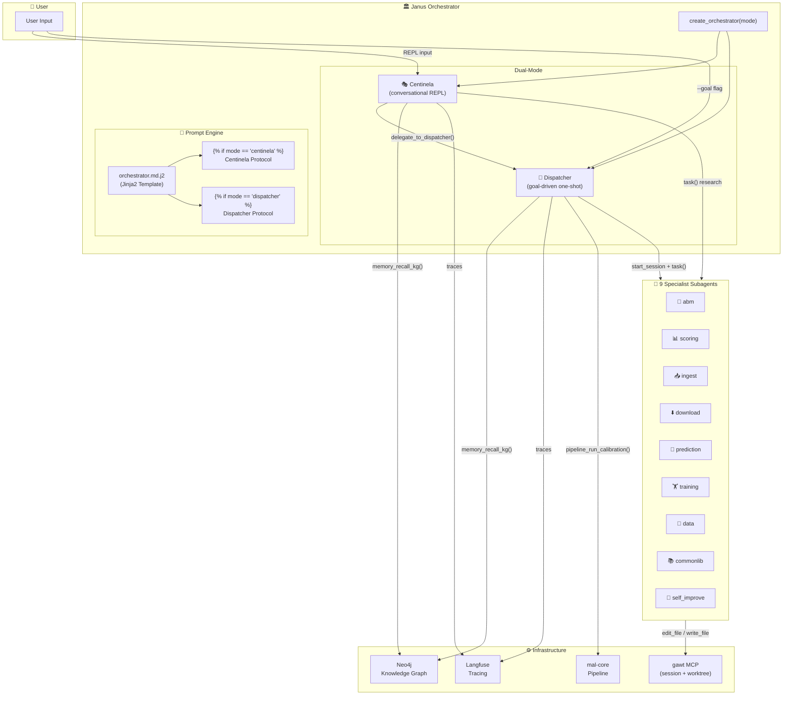
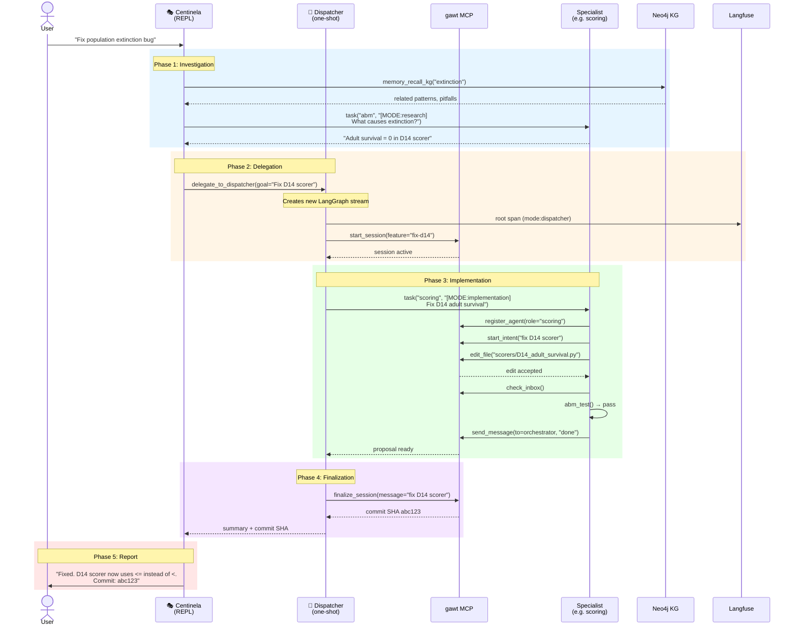
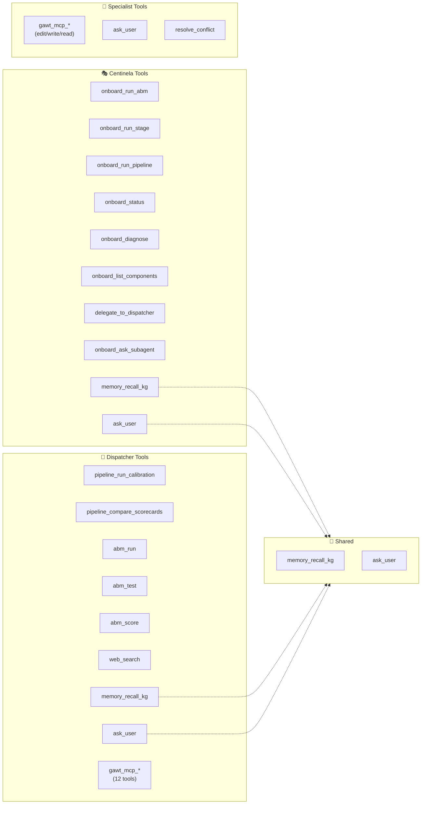
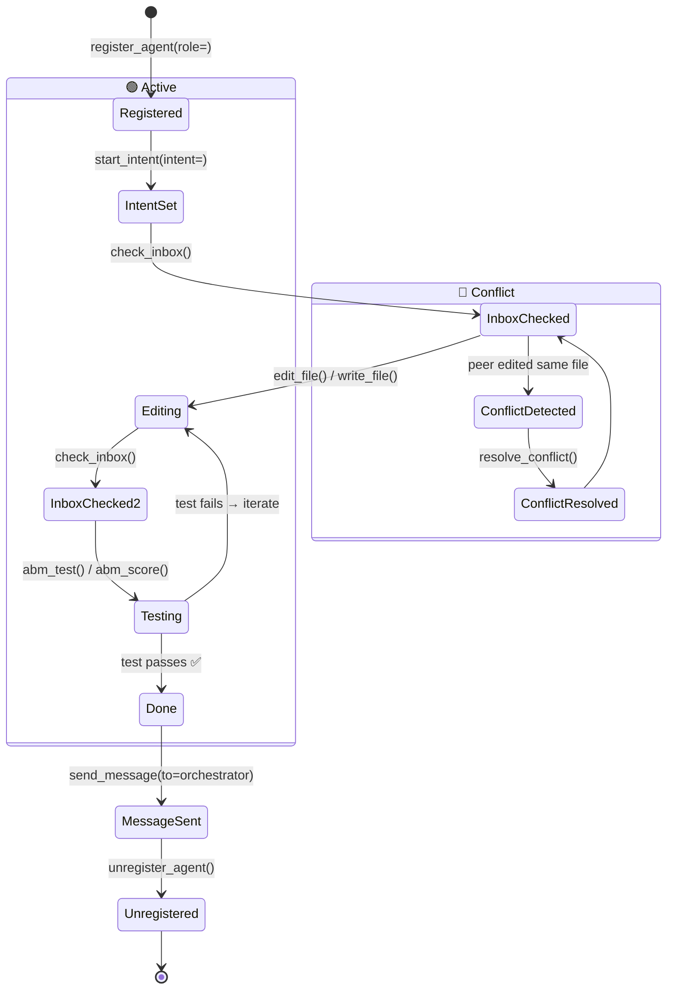
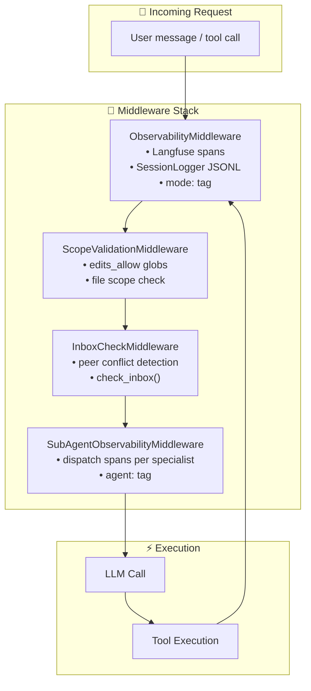
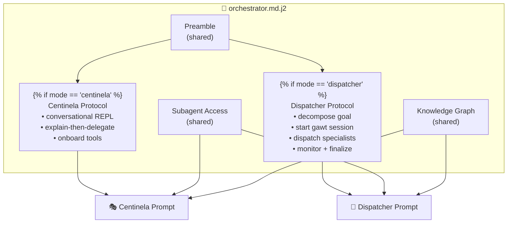
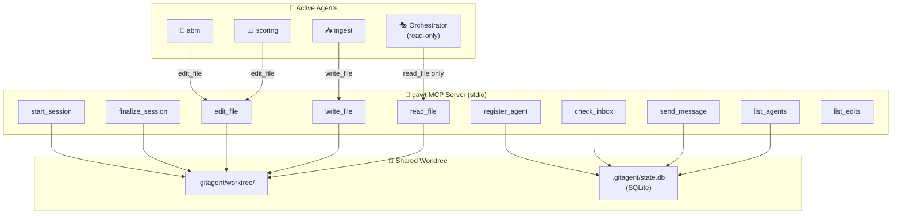
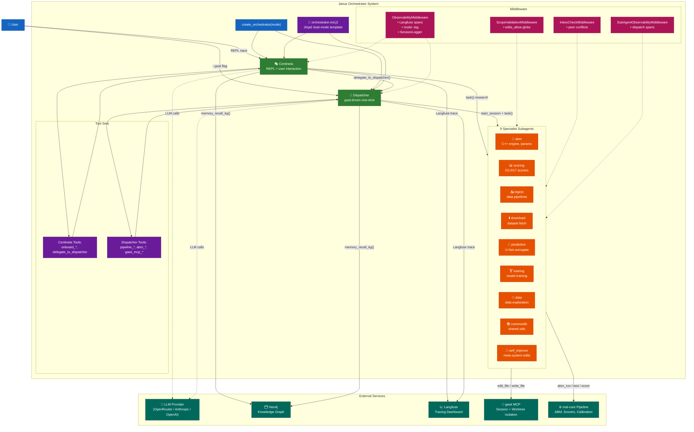

# Janus Architecture — Mermaid Diagrams

## 1. High-Level Overview

## 2. Delegation Flow — How Centinela and Dispatcher Cooperate

## 3. Tool Matrix — Who Has What

## 4. Specialist Subagent Lifecycle (gawt workflow)

## 5. Middleware Pipeline

## 6. Session Lifecycle — JSONL Logging

```mermaid
graph LR
    A["session_start"] --> B["tool_call: gitagent_init"]
    B --> C["decision: session_start"]
    C --> D["tool_call: gitagent_spawn"]
    D --> E["dispatch: scoring"]
    E --> F["tool_call: task(scoring, ...)"]
    F --> G["proposal: edit D14"]
    G --> H["tool_call: gitagent_finalize"]
    H --> I["summary: composite 0.65→0.72"]
    I --> J["session_end"]

    style A fill:#e8f5e9
    style J fill:#ffebee
    style E fill:#e3f2fd
    style I fill:#fff3e0
```

## 7. Prompt Rendering — Dual-Mode Template

## 8. gawt MCP — Session Isolation

## 9. Complete Component Map

---

## How to Use

Paste any of the Mermaid blocks into:
- GitHub markdown (renders automatically)
- [mermaid.live](https://mermaid.live) for interactive viewing
- Obsidian with the Mermaid plugin
- Any markdown renderer that supports Mermaid
