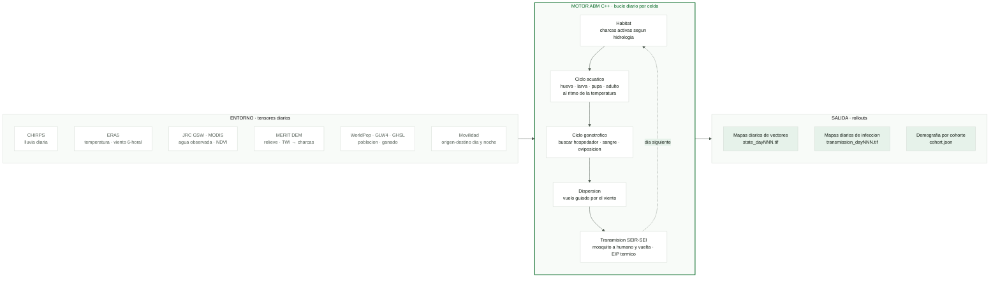

# Guion de presentacion — MalariaSentinel

> Version hablada de 10 minutos. Cada slide acompaña al discurso. Slide muestra poco; notas mentales recuerdan estructura; guion contiene desarrollo completo.

## Regla de uso

- No leer slides. Mirar audiencia.
- Memorizar solo **nota mental** y palabras en negrita.
- Guion sirve para ensayar, ajustar ritmo y recuperar ideas.
- Una slide = una idea. Si slide necesita explicacion escrita, tiene demasiado texto.

## Mapa rapido

| Slide | Tiempo | Bloque | Idea que debe quedar |
|---:|---:|---|---|
| 1 | 0:00–0:35 | Why | Un brote visible ya llega tarde |
| 2 | 0:35–1:20 | Why | La malaria sigue siendo una emergencia humana |
| 3 | 1:20–2:05 | Why | El sistema reacciona cuando deberia anticipar |
| 4 | 2:05–2:45 | Why | La pregunta es donde actuar primero |
| 5 | 3:20–4:05 | How | Muchos datos, una decision |
| 6 | 4:05–4:55 | How | El ABM por dentro: entorno, bucle biologico, rollouts |
| 7 | 4:55–5:40 | How | U-Net convierte detalle en velocidad |
| 8 | 5:40–6:30 | How | Cadena completa, calibrable y explicable |
| 9 | 6:30–7:25 | What | Ghana: pipeline real y salida real de la demo |
| 10 | 7:25–8:20 | What | Demo abierta: ustedes pueden ejecutarla |
| 11 | 9:05–10:00 | Cierre | Contribucion abierta: 4 ramas tecnicas + piloto de campo |

---

## Slide 1 — Cuando llega el brote

**Tiempo:** 0:00–0:35  
**Bloque:** Why  
**Visual:** Fotografia sobria de una comunidad o mapa oscuro sin etiquetas. Aparicion lenta de un punto rojo.

**Texto visible:** Ninguno. Como maximo, pequeno: `MalariaSentinel`.

**Nota mental:** **Brote visible = respuesta tarde.**

**Guion:**

> Imaginemos que una comunidad empieza a enfermar, los casos llegan al centro de salud, se confirma un brote y entonces se organiza la respuesta.
>
> Pero para ese momento, muchas personas ya estuvieron expuestas.
>
> La pregunta que nos hacemos es incomoda: **¿podemos llegar antes?**

**Transicion:** El problema no es abstracto. Tiene escala humana y global.

## Slide 2 — 610.000

**Tiempo:** 0:35–1:20  
**Bloque:** Why  
**Visual:** Una cifra enorme `610.000`; fondo con textura de puntos que sugiera personas, no una grafica saturada.

**Texto visible:** `610.000 muertes · 2024`.

**Nota mental:** **282 millones de casos. 94 % Africa.**

**Guion:**

> En 2024, la malaria produjo aproximadamente 282 millones de casos y 610.000 muertes. Cerca del 94 % de esa carga estuvo en Africa.
>
> Detras de cada cifra hay una familia, una escuela, un trabajador, un sistema de salud que tiene que prescindir de personas, que nunca son infinitos.
>
> Y, el problema no termina con contar casos. Cuando el caso aparece, necesitamos saber que condiciones hicieron posible esa transmision y donde pueden repetirse.

**Transicion:** La carga es enorme, pero la dificultad concreta esta en el momento de decidir.

## Slide 3 — Reaccionar / anticipar

**Tiempo:** 1:20–2:05  
**Bloque:** Why  
**Visual:** Dos lineas: una empieza despues del pico; otra empieza antes. Sin leyenda larga.

**Texto visible:** `despues` / `antes`.

**Nota mental:** **Datos existen. Decision llega tarde.**

**Guion:**

> Hoy ya existen datos valiosos: lluvia, temperatura, agua, vegetacion, terreno, poblacion, movilidad, casos y estudios de los mosquitos.
>
> El reto no es mirar una capa mas.
>
> El reto es que esas fuentes tienen formatos, escalas y tiempos diferentes. Y que un equipo local no necesita diez mapas aislados: necesita una respuesta accionable.
>
> ¿Que zona merece una visita? ¿Donde concentrar vigilancia? ¿Que intervencion tiene sentido antes de que el riesgo se convierta en casos?
>
> Muchas veces, el sistema solo puede responder despues de que los casos hagan visible el problema.

**Transicion:** Por eso cambiamos la pregunta.

## Slide 4 — ¿Donde primero?

**Tiempo:** 2:05–2:45  
**Bloque:** Why  
**Visual:** Mapa abstracto con muchas zonas atenuadas y una zona iluminada. No mostrar todavia un resultado real.

**Texto visible:** `¿Donde primero?`

**Nota mental:** **Recursos limitados. Priorizar.**

**Guion:**

> En eliminacion de malaria, no basta con saber que existe riesgo en un pais.
>
> Hay que distinguir que esta pasando en cada territorio y actuar con precision.
>
> Si los recursos son limitados, tratar todas las zonas igual no es neutral: significa perder oportunidades de impacto.
>
> MalariaSentinel nace para ayudar a responder una pregunta concreta: **¿donde deberiamos mirar y actuar primero, y como podemos comprobar despues si acertamos?**

## Slide 5 — Muchos datos, una decision

**Tiempo:** 3:20–4:05  
**Bloque:** How  
**Visual:** Tres grupos de iconos o imagenes: satelite/lluvia, mosquito/territorio, mapa/accion. Convergen en un solo punto.

**Texto visible:** `observar → entender → decidir`.

**Nota mental:** **Observacion. Mecanismo. Decision.**

**Guion:**

> Nuestro enfoque conecta tres niveles.
>
> Primero, observacion: reunimos datos ambientales, epidemiologicos y entomologicos.
>
> Segundo, mecanismo: intentamos representar como esas condiciones afectan al habitat, a los mosquitos y a la transmision.
>
> Tercero, decision: traducimos el resultado en mapas y escenarios que puedan ayudar a priorizar vigilancia e intervenciones.
>
> La diferencia importante es que no queremos producir un mapa bonito al final de una cadena opaca. Queremos que cada paso se pueda inspeccionar, calibrar y discutir con expertos locales.

**Transicion:** Para representar el mecanismo usamos un modelo basado en agentes.

## Slide 6 — El profesor, por dentro

**Tiempo:** 4:05–4:55  
**Bloque:** How  
**Visual:** Diagrama de las tripas del ABM (mermaid abajo): tres columnas — entorno que entra, bucle diario del motor, rollouts que salen. Una columna por idea. Senalar cada columna mientras se habla.

**Texto visible:** `ABM`.

**Nota mental:** **Entra entorno. Bucle diario. Salen rollouts.**

**Guion:**

> La primera pieza es un ABM, un modelo de simulacion basado en agentes. Vamos a abrirlo para mirar sus tripas.
>
> A la izquierda entra el territorio: lluvia de CHIRPS; temperatura y viento de ERA5; agua observada de JRC GSW y vegetacion de MODIS; el relieve de MERIT DEM, que decide donde se acumula el agua; poblacion humana y ganado de WorldPop y GLW; y movilidad de dia y de noche.
>
> En el centro, el motor. Cada dia, celda a celda, ejecuta un bucle biologico: activa las charcas que la hidrologia permite; desarrolla huevos, larvas y pupas al ritmo que marca la temperatura; las hembras adultas buscan hospedador, se alimentan y oviponen; se dispersan empujadas por el viento.
>
> Y si hay malaria, la infeccion va del mosquito al humano y vuelve, con un periodo de incubacion que tambien depende de la temperatura.
>
> A la derecha salen los rollouts: mapas diarios de vectores y de infeccion, y la demografia de cada cohorte.
>
> El ABM funciona como un profesor: biologicamente explicito e inspeccionable, pero cada escenario cuesta tiempo de computacion.

**Transicion:** Para tomar decisiones operativas necesitamos conservar el aprendizaje y reducir el tiempo.

**Diagrama de la diapositiva (mermaid):**

## Slide 7 — El estudiante

**Tiempo:** 4:55–5:40  
**Bloque:** How  
**Visual:** Flecha del conjunto de rollouts del ABM hacia una prediccion de mapa casi instantanea.

**Texto visible:** `ABM → U-Net`.

**Nota mental:** **Aprender detalle. Responder rapido.**

**Guion:**

> Por eso usamos una segunda pieza: una U-Net como modelo sustituto.
>
> El ABM genera muchos escenarios. La U-Net aprende de esos escenarios y despues puede producir una aproximacion mucho mas rapida.
>
> Es como un estudiante que aprende de un profesor: no sustituye la evidencia ni la validacion del profesor, pero puede responder rapidamente cuando necesitamos comparar muchas posibilidades.
>
> La velocidad permite explorar escenarios. La calibracion decide si esos escenarios merecen confianza.

**Transicion:** Las dos piezas forman parte de una cadena mayor.

## Slide 8 — De datos a riesgo

**Tiempo:** 5:40–6:30  
**Bloque:** How  
**Visual:** Seis palabras o iconos, en secuencia. Sin definiciones.

**Texto visible:** `datos · habitat · ABM · calibracion · U-Net · riesgo`.

**Nota mental:** **Cadena completa.**

**Guion:**

> El flujo completo tiene seis pasos.
>
> Descargamos y normalizamos datos por area de interes.
>
> Los llevamos a una grilla comun para construir una lectura de idoneidad ambiental.
>
> Ejecutamos el ABM y generamos rollouts.
>
> Comparamos sus curvas y patrones espaciales con observaciones para calibrarlo.
>
> Entrenamos la U-Net con esas salidas.
>
> Y finalmente generamos mapas de riesgo que pueden apoyar una priorizacion.
>
> No es una unica caja negra. Es una cadena de evidencia, con puntos donde podemos preguntar que sabemos, que suponemos y que necesitamos medir.

---

## Slide 9 — Ghana

**Tiempo:** 6:30–7:25  
**Bloque:** What  
**Visual:** Resultado real de la demo: mapa o animacion del escenario "Brote Focal Anual" en Ghana (captura de malariasentinel.com). Capas que aparecen una a una: densidad de vectores y propagacion de la infeccion.

**Texto visible:** `Ghana`.

**Nota mental:** **Ya corre de extremo a extremo. Salida real en pantalla.**

**Guion:**

> ¿Que existe hoy?
>
> MalariaSentinel tiene un caso de trabajo inicial en Ghana y un pipeline ejecutable de extremo a extremo.
>
> Puede descargar y registrar datos, construir entradas ambientales, ejecutar un motor ABM en C++, puntuar calibracion, entrenar un modelo sustituto y producir una salida de prediccion de riesgo.
>
> Las etapas se pueden ejecutar desde una CLI: `download`, `ingest`, `abm`, `score`, `train` y `predict`.
>
> Lo que ven en pantalla no es un mockup: es la salida de una ejecucion real. Un brote focal anual simulado sobre Ghana, con mapas diarios de vectores e infeccion.
>
> Esto no significa que el problema este resuelto. Significa que ya tenemos una base sobre la que se puede medir, corregir y validar con datos de programa.

**Transicion:** Y esta demo la puede ejecutar cualquiera de ustedes. Veamos como.

## Slide 10 — Ejecuten ustedes la demo

**Tiempo:** 7:25–8:20  
**Bloque:** What  
**Visual:** Diagrama del flujo del configurador interactivo (mermaid abajo). Enlace grande y visible: `malariasentinel.com` (seccion Configurador ABM). Reserva: captura del configurador con el escenario recomendado.

**Texto visible:** `Pruebenla: malariasentinel.com`.

**Nota mental:** **Escenario. Comando. Artefactos.**

**Guion:**

> Todo lo que acaban de ver es reproducible, y no hace falta pertenecer al equipo.
>
> En malariasentinel.com hay un configurador interactivo de simulacion. Entran, eligen un escenario predefinido —por ejemplo, un brote focal anual en Ghana— o ajustan parametros: zona, duracion, numero de simulaciones, semilla, focos del brote.
>
> El configurador genera en vivo el comando exacto para terminal. Lo copian, lo ejecutan, y obtienen los mismos artefactos que acabamos de ver: mapas diarios de vectores, mapas de infeccion, demografia por cohorte y las animaciones.
>
> Cuando lo ejecuten, lean el resultado como nosotros: el mapa no dice "aqui habra un caso"; dice "bajo estos datos y estos supuestos, esta zona merece atencion prioritaria".
>
> No es una demo cerrada ni un video. Es un instrumento abierto que cualquiera puede poner a prueba con su propia region.

**Transicion:** Y la unica forma de comprobarlo de verdad es con una zona y una decision reales.

**Diagrama de la diapositiva (mermaid):**

```mermaid
%%{init: {"theme":"base","themeVariables":{"background":"#F8FBF8","primaryColor":"#FFFFFF","primaryBorderColor":"#D3DAD3","primaryTextColor":"#101911","secondaryColor":"#E6F2EA","tertiaryColor":"#F8FBF8","lineColor":"#505B52","clusterBkg":"#F8FBF8","clusterBorder":"#D3DAD3","fontSize":"14px"}}}%%
flowchart LR
    subgraph PASO1["1 · CONFIGURAR — malariasentinel.com"]
        direction TB
        ESC["Escenario recomendado<br/>Brote Focal Anual · 365 dias · 5 aldeas"]
        PAR["O parametros libres<br/>zona · duracion · rollouts · semilla<br/>transmision · focos y casos del brote"]
    end

    subgraph PASO2["2 · EJECUTAR"]
        direction TB
        CMD["Comando listo para copiar<br/>malariasim abm --aoi ghana --days 365"]
        RUN["Motor ABM C++<br/>simulacion estocastica en la grilla"]
    end

    subgraph PASO3["3 · RESULTADO — artefactos"]
        direction TB
        A1["Mapas de vectores<br/>53 GeoTIFFs"]
        A2["Mapas de infeccion SEIR<br/>53 GeoTIFFs"]
        A3["Demografia por cohorte<br/>cohort.json"]
        A4["Animaciones de propagacion<br/>2 GIFs"]
    end

    PASO1 --> PASO2
    CMD --> RUN
    PASO2 --> PASO3
    PASO3 --> MAP["El mapa que<br/>acabamos de ver"]

    classDef destacado fill:#E6F2EA,stroke:#D3DAD3,color:#101911
    classDef web fill:#FFFFFF,stroke:#D3DAD3,color:#101911
    classDef paso fill:#FFFFFF,stroke:#D3DAD3,color:#101911
    classDef artefacto fill:#FFFFFF,stroke:#D3DAD3,color:#505B52
    classDef focal fill:#006622,stroke:#006622,color:#FFFFFF
    class ESC destacado
    class PAR web
    class CMD,RUN paso
    class A1,A2,A3,A4 artefacto
    class MAP focal
```

## Slide 11 — Contribuyan: codigo y territorio

**Tiempo:** 9:05–10:00  
**Bloque:** Cierre  
**Visual:** Cuatro tarjetas de contribucion tecnica (epidemiologia-entomologia, ingenieria geoespacial, ML-simulacion, diseno-producto) + una tarjeta destacada de piloto de campo. Tres pasos de entrada: clonar → pytest → PR. QR y enlace solo al final.

**Texto visible:** `github.com/ANFAIA/MalariaSentinel` + `Una zona. Una decision. Un piloto.`

**Nota mental:** **Proyecto abierto. Cuatro ramas tecnicas. Un piloto.**

**Guion:**

> Todo lo que han visto es abierto: codigo Apache 2.0, plan de desarrollo y hoja de ruta publicos. Y hay cuatro frentes donde sumarse.
>
> Epidemiologia y entomologia: parametros biologicos, resistencia a insecticidas, curvas de picadura. Ingenieria geoespacial: pipelines satelitales, mallas Zarr y NetCDF, cuencas hidrologicas. Machine learning y simulacion: el emulador U-Net y la paralelizacion en C++. Y diseno de producto: la plataforma Centinela y su cartografia de riesgo.
>
> Entrar es corto: clonar el repositorio, sincronizar con uv, validar la suite con pytest y abrir un PR.
>
> Y si su capital es territorio y no codigo, la invitacion es la misma: una zona, una decision operativa, datos de campo. Un piloto, no un pais.
>
> MalariaSentinel no reemplaza el conocimiento local; ayuda a que ese conocimiento llegue antes a la decision.
>
> La pregunta final es: **¿que podriamos anticipar juntos si el mapa de riesgo llegara antes que el brote?**
>
> [Pausa. Mostrar QR y enlace. No añadir explicacion tecnica despues del CTA.]

---

## Tarjeta mental de bolsillo

Para ensayar sin memorizar todo:

1. **Brote:** cuando vemos el brote, ya hubo exposicion.
2. **Carga:** 282 millones de casos; 610.000 muertes; Africa concentra la carga.
3. **Brecha:** datos existen, decision llega tarde.
4. **Creencia:** anticipar sin reemplazar conocimiento local.
5. **Metodo:** observar, entender mecanismos, decidir.
6. **ABM:** entra entorno, bucle biologico diario, salen rollouts; profesor lento.
7. **U-Net:** velocidad, estudiante aproximado.
8. **Pipeline:** datos → habitat → ABM → calibracion → U-Net → riesgo.
9. **Producto:** Ghana ya corre de extremo a extremo; slide 10 muestra salida real.
10. **Demo:** configurador web → comando → artefactos; ejecutable por cualquiera.
11. **Honestidad:** Dice 0,24; no predictor clinico.
12. **Peticion:** contribuidores tecnicos (4 ramas); ONG: una zona, una decision, datos de campo.
13. **Cierre:** anticipar antes del brote.

## Ensayo y control

- Leer guion completo una vez para interiorizar tono.
- Ensayar usando solo notas mentales.
- Cronometrar cada slide; cortar ejemplos antes que principios.
- Dejar pausas despues de `¿podemos llegar antes?`, `¿donde primero?` y `0,24`.
- Sustituir capturas genericas por resultados reales antes de presentar.
- Probar el configurador de malariasentinel.com en vivo; llevar captura del escenario recomendado como reserva.
- Confirmar cifra global con OMS.
- Preparar respuesta para tres preguntas: validacion, datos necesarios y utilidad para una ONG.
- QR y enlace deben estar probados; llevar capturas offline.
