# M-AGENT — New GitAgent (MCP-native) + Multi-Agent Coordination (STUB)

> **Status**: Stub (2026-08-07). Full plan to be drafted after base review.
>
> **Scope**: Reimagine Janus around the new gitagent v0.5.0 (MCP server, single shared worktree, live edit tracking, semantic intents, inbox). The orchestrator becomes a **high-level dispatcher**; each specialist becomes a **planner + executor** that calls gitagent MCP tools directly. The sibling coordination (intent/peer_message/watcher) is **replaced** by gitagent's native `intents` and `inbox` systems.
>
> **Labels**: `M-AGENT`, `enhancement`, `M10+` (post-M7+).
>
> **Predecessor**: M14 (Two-Tier Orchestrator + Plugin System) — current Janus as we know it.
>
> **External dependency**: **`gawt`** (the new gitagent, branch `feat/mcp-sqlite-core`). Must be installed from the branch, not PyPI — currently `uv pip install -e git+https://github.com/david-fm/gawt.git@feat/mcp-sqlite-core`. When stable, this dependency will be promoted to PyPI by the user.

---

## 0. New architecture diagram

```mermaid
graph TB
    %% ══════════════════════════════════════════════════════════════
    %% CAPA 1 — USER + CLI
    %% ══════════════════════════════════════════════════════════════
    subgraph USER["Usuario"]
        U_GOAL["User goal<br/>'Fix extinction...'"]
    end

    subgraph CLI["CLI Layer (Typer)"]
        direction LR
        CLI_MAIN["janus<br/>(no args → Onboarding)"]
        CLI_RUN["janus run -g '...'<br/>Dispatcher entry"]
        CLI_ONBOARD["janus onboard<br/>REPL conversacional"]
    end

    %% ══════════════════════════════════════════════════════════════
    %% CAPA 2 — ORCHESTRATOR (dispatcher, no direct work)
    %% ══════════════════════════════════════════════════════════════
    subgraph ORCHESTRATOR["Orchestrator (Dispatcher)"]
        direction TB
        O_RECEIVE["1. Receive goal"]
        O_DECOMPOSE["2. DECOMPOSE<br/>LLM → subtasks"]
        O_IDENTIFY["3. IDENTIFY<br/>specialists needed"]
        O_DISPATCH["4. DISPATCH<br/>spawn specialist agents"]
        O_MONITOR["5. MONITOR<br/>mcp__gitagent__list_agents<br/>+ check_inbox"]
        O_FINALIZE["6. FINALIZE<br/>mcp__gitagent__finalize_session"]
        O_RECEIVE --> O_DECOMPOSE --> O_IDENTIFY --> O_DISPATCH --> O_MONITOR --> O_FINALIZE
    end

    %% ══════════════════════════════════════════════════════════════
    %% CAPA 3 — gawt MCP server (the new gitagent — shared worktree)
    %% ══════════════════════════════════════════════════════════════
    subgraph GAWT["gawt MCP server (stdio)"]
        direction LR
        subgraph GAWT_SESSION["Session / Worktree"]
            GS_LIFECYCLE["start_session<br/>finalize_session<br/>abort_session<br/>get_session"]
            GS_AGENTS["register_agent<br/>unregister_agent<br/>list_agents"]
        end
        subgraph GAWT_INTENTS["Semantic Intent"]
            GS_INTENT["start_intent<br/>repurpose<br/>get_current_intent"]
        end
        subgraph GAWT_EDITS["File Editing (atomic)"]
            GS_EDIT["edit_file<br/>write_file<br/>read_file<br/>delete_file"]
        end
        subgraph GAWT_INBOX["Coordination"]
            GS_INBOX["check_inbox<br/>send_message<br/>list_edits<br/>list_intents"]
        end
        subgraph GAWT_STATE[".gitagent/state.db<br/>SQLite — single source of truth"]
            DB_SESSION["session"]
            DB_AGENTS["agents"]
            DB_INTENTS["intents"]
            DB_EDITS["edits<br/>(agent_id, file, op, intent_id, ts)"]
            DB_INBOX["inbox<br/>(conflict / manual / system)"]
        end
        GS_LIFECYCLE --> DB_SESSION
        GS_AGENTS --> DB_AGENTS
        GS_INTENT --> DB_INTENTS
        GS_EDIT --> DB_EDITS
        GS_INBOX --> DB_INBOX
        GAWT_SESSION --> GAWT_INTENTS
        GAWT_INTENTS --> GAWT_EDITS
        GAWT_EDITS --> GAWT_INBOX
    end

    subgraph WORKTREE[".gitagent/worktree/<br/>single detached worktree<br/>(shared by all agents)"]
        WT_FILES["src/auth.py, tests/..., etc.<br/>atomic writes via temp+rename"]
    end

    %% ══════════════════════════════════════════════════════════════
    %% CAPA 4 — SPECIALIST AGENTS (planner + executor, share worktree)
    %% ══════════════════════════════════════════════════════════════
    subgraph SPECIALISTS["Specialist Agents (parallel, shared worktree)"]
        direction TB
        subgraph SA_ABM["abm specialist"]
            ABM_REG["register_agent(role='abm')<br/>→ a_3f2c"]
            ABM_INTENT["start_intent('fix oviposition transition')"]
            ABM_EDIT["edit_file / write_file<br/>in shared worktree"]
            ABM_INBOX["check_inbox<br/>after each edit"]
            ABM_REG --> ABM_INTENT --> ABM_EDIT --> ABM_INBOX
        end
        subgraph SA_SCORING["scoring specialist"]
            SC_REG["register_agent<br/>→ a_7b1e"]
            SC_INTENT["start_intent('add D15 scorer')"]
            SC_EDIT["edit_file / write_file"]
            SC_INBOX["check_inbox"]
            SC_REG --> SC_INTENT --> SC_EDIT --> SC_INBOX
        end
        subgraph SA_INGEST["ingest specialist"]
            IN_REG["register_agent"]
            IN_INTENT["start_intent"]
            IN_EDIT["edit_file"]
            IN_INBOX["check_inbox"]
            IN_REG --> IN_INTENT --> IN_EDIT --> IN_INBOX
        end
        subgraph SA_OTHERS["others (parallel)"]
            direction LR
            SA_DOWNLOAD["download"]
            SA_PREDICTION["prediction"]
            SA_TRAINING["training"]
            SA_DATA["data"]
            SA_COMMONLIB["commonlib"]
            SA_RESEARCH["research (read-only)"]
        end
    end

    %% ══════════════════════════════════════════════════════════════
    %% CAPA 5 — OBSERVABILITY (Janus-managed)
    %% ══════════════════════════════════════════════════════════════
    subgraph OBSERVE["Observability Stack (Janus-side)"]
        direction LR
        subgraph SINKS["3 sinks, 1 fan-out"]
            OBS_JSONL["SessionLogger<br/>JSONL"]
            OBS_PANEL["LivePanel<br/>multi-agent rows<br/>(1 row per specialist)"]
            OBS_LANG["Langfuse SDK<br/>trace per specialist + orchestrator"]
        end
    end

    %% ══════════════════════════════════════════════════════════════
    %% CAPA 6 — KNOWLEDGE GRAPH
    %% ══════════════════════════════════════════════════════════════
    subgraph KB["Knowledge Graph (Neo4j)"]
        direction LR
        KB_QUERY["memory_recall_kg"]
        KB_ADD["mcp__add_memory"]
    end

    %% ══════════════════════════════════════════════════════════════
    %% CAPA 7 — ABM PIPELINE (executed by specialists)
    %% ══════════════════════════════════════════════════════════════
    subgraph PIPELINE["ABM Pipeline (6 stages)"]
        direction LR
        PL_DOWN["1. download"]
        PL_ING["2. ingest"]
        PL_ABM["3. abm"]
        PL_SCORE["4. score"]
        PL_TRAIN["5. train"]
        PL_PRED["6. predict"]
        PL_DOWN --> PL_ING --> PL_ABM --> PL_SCORE --> PL_TRAIN --> PL_PRED
    end

    %% ══════════════════════════════════════════════════════════════
    %% REMOVED (vs M14)
    %% ══════════════════════════════════════════════════════════════
    subgraph REMOVED["REMOVED (M14 → M-AGENT)"]
        direction LR
        RM_CLI["x gitagent CLI<br/>(propose / spawn / accept / integrate)"]
        RM_SIBLING["x Janus sibling/<br/>(intent / peer_message / watcher / ASTIndex)"]
        RM_PROPOSE["x proposal/patch<br/>pipeline"]
        RM_INTEGRATE["x gitagent_integrate<br/>(squash + integrate step)"]
    end

    %% ══════════════════════════════════════════════════════════════
    %% CONEXIONES
    %% ══════════════════════════════════════════════════════════════

    %% User → CLI → Orchestrator
    U_GOAL --> CLI_RUN
    CLI_RUN --> ORCHESTRATOR

    %% Orchestrator → gawt (session lifecycle)
    O_DISPATCH -->|start_session| GS_LIFECYCLE
    O_FINALIZE -->|finalize_session| GS_LIFECYCLE

    %% Orchestrator → specialists (via deepagents task)
    O_DISPATCH -->|deepagents task| SA_ABM
    O_DISPATCH -->|deepagents task| SA_SCORING
    O_DISPATCH -->|deepagents task| SA_INGEST

    %% Specialists → gawt (register, edit, query)
    ABM_REG -->|register_agent| GS_AGENTS
    ABM_EDIT -->|edit_file / write_file| GS_EDIT
    ABM_INBOX -->|check_inbox| GS_INBOX
    SC_REG -->|register_agent| GS_AGENTS
    SC_EDIT -->|edit_file / write_file| GS_EDIT
    IN_EDIT -->|edit_file / write_file| GS_EDIT

    %% Specialists → worktree (actual file changes)
    GS_EDIT --> WT_FILES

    %% Specialists → intents (semantic attribution)
    ABM_INTENT -->|start_intent| GS_INTENT
    SC_INTENT -->|start_intent| GS_INTENT

    %% Orchestrator monitors via gawt
    O_MONITOR -->|list_agents / list_edits| GS_INBOX

    %% Knowledge Graph
    O_DECOMPOSE -->|recall patterns| KB_QUERY
    ABM_INTENT -->|recall patterns| KB_QUERY

    %% Pipeline (executed by specialists)
    ABM_EDIT -->|runs| PL_ABM
    SC_EDIT -->|runs| PL_SCORE
    IN_EDIT -->|runs| PL_ING

    %% Observability
    ORCHESTRATOR --> OBS_JSONL
    SA_ABM --> OBS_JSONL
    SA_SCORING --> OBS_JSONL
    OBS_JSONL ~~~ OBS_PANEL
    OBS_PANEL ~~~ OBS_LANG

    %% Styling
    classDef userStyle fill:#e1f5fe,stroke:#01579b,stroke-width:2px
    classDef cliStyle fill:#e1f5fe,stroke:#0288d1,stroke-width:2px
    classDef orchStyle fill:#f3e5f5,stroke:#7b1fa2,stroke-width:3px
    classDef gawtStyle fill:#fff9c4,stroke:#f57f17,stroke-width:3px
    classDef wtStyle fill:#fff3e0,stroke:#e65100,stroke-width:2px
    classDef saStyle fill:#e8f5e9,stroke:#2e7d32,stroke-width:2px
    classDef obsStyle fill:#fbe9e7,stroke:#d84315,stroke-width:2px
    classDef kbStyle fill:#e8eaf6,stroke:#283593,stroke-width:2px
    classDef pipelineStyle fill:#f9fbe7,stroke:#827717,stroke-width:2px
    classDef removedStyle fill:#ffebee,stroke:#b71c1c,stroke-width:2px,stroke-dasharray: 5 5
    classDef dbStyle fill:#f3e5f5,stroke:#4a148c,stroke-width:1px

    class U_GOAL userStyle
    class CLI_MAIN,CLI_RUN,CLI_ONBOARD cliStyle
    class ORCHESTRATOR,O_RECEIVE,O_DECOMPOSE,O_IDENTIFY,O_DISPATCH,O_MONITOR,O_FINALIZE orchStyle
    class GAWT,GS_LIFECYCLE,GS_AGENTS,GS_INTENT,GS_EDIT,GS_INBOX,GAWT_SESSION,GAWT_INTENTS,GAWT_EDITS,GAWT_INBOX,GAWT_STATE gawtStyle
    class WORKTREE,WT_FILES wtStyle
    class SA_ABM,SA_SCORING,SA_INGEST,SA_OTHERS,ABM_REG,ABM_INTENT,ABM_EDIT,ABM_INBOX,SC_REG,SC_INTENT,SC_EDIT,SC_INBOX,IN_REG,IN_INTENT,IN_EDIT,IN_INBOX,SA_DOWNLOAD,SA_PREDICTION,SA_TRAINING,SA_DATA,SA_COMMONLIB,SA_RESEARCH saStyle
    class OBSERVE,OBS_JSONL,OBS_PANEL,OBS_LANG obsStyle
    class KB,KB_QUERY,KB_ADD kbStyle
    class PIPELINE,PL_DOWN,PL_ING,PL_ABM,PL_SCORE,PL_TRAIN,PL_PRED pipelineStyle
    class REMOVED,RM_CLI,RM_SIBLING,RM_PROPOSE,RM_INTEGRATE removedStyle
    class DB_SESSION,DB_AGENTS,DB_INTENTS,DB_EDITS,DB_INBOX dbStyle
```



**Diagram legend**:

- **Purple** (thick border) = Orchestrator (the new dispatcher).
- **Yellow** = gawt MCP server (the new gitagent — shared worktree, live tracking, intents, inbox).
- **Orange** = `.gitagent/worktree/` (single shared worktree).
- **Green** = Specialist agents (planner + executor, share worktree).
- **Gray strikethrough** = Components removed from M14.

---

## 1. Why this plan exists

### 1.1 The current state (Janus M14 + gitagent v0.4)

Today, Janus integrates with `gitagent` via CLI subprocess calls:

```
Janus orchestrator (Python)
  → subprocess.run(["gitagent", "spawn", ...])
  → subprocess.run(["gitagent", "propose", ...])
  → subprocess.run(["gitagent", "integrate", ...])
```

The M14 sibling coordination system was supposed to handle conflicts between agents working in different worktrees, but as documented in the existing architecture:

- **Sibling coordination is for shared worktrees**, but gitagent spawns **one worktree per agent**.
- **Result**: claims, peer_messages, and watchers are all per-worktree, so cross-worktree detection is structurally impossible.

This is a problem the new gitagent v0.5.0 solves natively.

### 1.2 What the new gitagent v0.5.0 provides

The new gitagent (branch `feat/mcp-sqlite-core`, package `gawt`) is a complete redesign:

| Old (v0.4.2) | New (v0.5.0) |
|---|---|
| CLI only (`gitagent start`, `spawn`, `propose`, `integrate`, `finalize`) | **MCP server** (stdio transport) |
| One worktree per `gitagent_spawn` | **Single global worktree** per session |
| Agents submit patches as proposals | Agents edit files directly via `edit_file` / `write_file` |
| Orchestrator reviews proposals | No proposals — worktree state is the source of truth |
| Integration step applies patches | `finalize_session` commits the worktree state |
| Manual conflict detection at integrate | **Built-in conflict detection** via `inbox` (advisory, not blocking) |
| No edit attribution | **Live edit tracking** with `(agent_id, file, op, intent_id, ts)` |
| No semantic context | **Semantic intents** (`start_intent`, `repurpose`) annotate edits |

The new gitagent is the **coordination layer** that M14 tried to build from scratch. It already handles:
- Single shared worktree (no per-agent isolation)
- Atomic file writes (no half-written states)
- Conflict detection (inserts `inbox` rows when another agent edits the same file)
- Edit attribution (every edit is tracked with `(agent_id, intent_id)`)
- Inter-agent messaging (`send_message`, `check_inbox`)
- Session lifecycle (`start_session`, `finalize_session`, `abort_session`)

### 1.3 What we need to build

With the new gitagent, Janus becomes much simpler:

- **Replace** the sibling coordination system entirely (intent, peer_message, watcher, ASTIndex, merge_preflight, recovery, coordination) — gitagent's `intents` and `inbox` replace them.
- **Replace** the `gitagent_tool.py` CLI wrappers with MCP tool calls (the MCP server is already there).
- **Refactor** the orchestrator's role from "methodology executor" to "high-level dispatcher".
- **Refactor** each specialist from "worker in isolated worktree" to "planner + executor in shared worktree".
- **Update** the LivePanel to show multi-agent rows.
- **Keep** the migration of CLI subprocess calls to direct MCP tool calls.

### 1.4 What we KEEP from M14

| Module | Status | Why |
|---|---|---|
| `agent.py` (create_orchestrator) | Refactored | Orchestrator becomes a dispatcher. |
| `onboarding.py` | Kept as-is | REPL for users. Unchanged. |
| `cli.py` | Refactored | `run` and `improve` become dispatcher entries. |
| `subagents/registry.py` | Kept | Still defines 9 specialists. |
| `subagents/builder.py` | Kept | Builds specialist deepagents. |
| `plugins/` | Kept | Plugin chain still applies per specialist. |
| `plugins/sibling.py` | **Removed** | Replaced by gitagent inbox. |
| `observability.py` | Kept | Same 3 sinks (JSONL, LivePanel, Langfuse). |
| `logger.py` | Kept | Same. |
| `live_panel.py` | Extended | Multi-agent rows. |
| `scope_validator.py` | Refactored | Validates `edits` table rows, not diff proposals. |
| `sibling/` | **All removed** | gitagent replaces it. |
| `tools/gitagent_tool.py` | **Removed** | Replaced by MCP tool calls. |
| `tools/pipeline_tool.py` | Kept | ABM pipeline tools. |
| `tools/kg_tool.py` | Kept | KG recall. |
| `tools/ask_user_tool.py` | Kept | Always needed. |
| `tools/onboard_tools.py` | Kept | Onboarding REPL tools. |

---

## 2. New architecture

### 2.1 Components

| Component | Role | Lives in |
|---|---|---|
| **Orchestrator** | High-level dispatcher. Decomposes goals, spawns specialists, monitors, finalizes. | One deepagent. No worktree. Calls `mcp__gitagent__*` tools. |
| **Specialist Agent** | Domain expert (abm, scoring, ingest, etc.). Plans its own work, executes in shared worktree via gitagent MCP, calls other specialists via MCP. | Multiple deepagents, parallel. All share the same `.gitagent/worktree/`. |
| **gawt MCP server** | Worktree manager + edit tracker + intent log + inbox. Single source of truth for all multi-agent coordination. | External dependency (`gawt` from `feat/mcp-sqlite-core`). |
| **LivePanel** | Multi-agent status display. One row per active specialist. | `agents/janus/src/agents_janus/live_panel.py`. |
| **Knowledge Graph** | Past patterns, pitfalls, investigations. | Neo4j via MCP. |
| **ABM Pipeline** | 6-stage pipeline executed by specialists. | `mal-core`, `mal-execution`. |

### 2.2 Key architectural shift

**Before (M14)**: 
```
Orchestrator → spawns workers → each worker in OWN worktree → propose → integrate → finalize
                                              ↑
                                    Sibling coordination (broken)
```

**After (M-AGENT)**:
```
Orchestrator → starts session → spawns specialists → all share ONE worktree → finalize
                                              ↑
                                    gawt native (intents + inbox + SQLite)
```

### 2.3 What stays from M14

(Reiterated from §1.4 for emphasis.)

| Module | Status | Why |
|---|---|---|
| `agent.py` | Refactored | Orchestrator becomes dispatcher. |
| `onboarding.py` | Kept | REPL for users. |
| `cli.py` | Refactored | Dispatcher entries. |
| `subagents/registry.py` | Kept | 9 specialists. |
| `subagents/builder.py` | Kept | Builder. |
| `plugins/` | Kept (except sibling) | Domain plugins. |
| `observability.py` | Kept | 3 sinks. |
| `logger.py` | Kept | JSONL. |
| `live_panel.py` | Extended | Multi-agent rows. |
| `scope_validator.py` | Refactored | Validates `edits` rows. |
| `sibling/` | **All removed** | gitagent replaces it. |
| `tools/gitagent_tool.py` | **Removed** | MCP tools replace. |
| `tools/pipeline_tool.py` | Kept | ABM. |
| `tools/kg_tool.py` | Kept | KG. |
| `tools/ask_user_tool.py` | Kept | Always. |
| `tools/onboard_tools.py` | Kept | REPL. |

---

## 3. New orchestrator role

### 3.1 Old role (M14)

The orchestrator was a **doer**:
- Ran 7-phase methodology (recon → diagnostics → hypotheses → review → diagnosis → delegate → validate).
- Read code, ran tests, formed hypotheses.
- Spawned workers via gitagent CLI.
- Captured proposals, reviewed, accepted/rejected.

### 3.2 New role (M-AGENT)

The orchestrator is a **dispatcher**:

```
USER GOAL
    │
    ▼
ORCHESTRATOR (dispatcher)
    │
    ├── 1. DECOMPOSE: LLM thinks → subtasks
    │     └─ "Fix extinction" → [fix abm, add D15 scorer, audit env]
    │
    ├── 2. IDENTIFY specialists
    │     └─ [abm, scoring, ingest]
    │
    ├── 3. START SESSION via gawt MCP
    │     └─ mcp__gitagent__start_session(feature="fix_extinction")
    │
    ├── 4. DISPATCH specialists (parallel deepagents)
    │     ├─ specialist ABM receives: "Task: fix oviposition transition"
    │     ├─ specialist SCORING receives: "Task: add D15 extinction scorer"
    │     └─ specialist INGEST receives: "Task: audit env tensor"
    │
    ├── 5. MONITOR via gawt MCP
    │     ├─ mcp__gitagent__list_agents() → active specialists
    │     ├─ mcp__gitagent__list_edits(since_ts=...) → recent edits
    │     └─ mcp__gitagent__list_intents() → intent graph
    │
    └── 6. FINALIZE via gawt MCP
          └─ mcp__gitagent__finalize_session(message="fix: extinction")
```

#### Orchestrator capabilities

- **Decompose** the goal using the LLM (no fixed methodology).
- **Start session** via `mcp__gitagent__start_session()`.
- **Dispatch** specialists via deepagents `task` tool.
- **Monitor** via `mcp__gitagent__list_agents()`, `list_edits()`, `list_intents()`.
- **Finalize** via `mcp__gitagent__finalize_session()`.

#### Orchestrator restrictions

- **No direct file editing**. The orchestrator never uses `edit_file` / `write_file`. Only lifecycle tools.
- **No reading code** in detail. Specialists handle their own reconnaissance.
- **No hypotheses**. Specialists form their own.

### 3.3 New orchestrator prompt (sketch)

```
You are the Janus orchestrator. Your role is to coordinate specialist agents via gawt.

You do NOT:
- Edit files via mcp__gitagent__edit_file or write_file
- Read code in detail
- Run ABM simulations
- Form hypotheses about bugs

You DO:
- Receive the user's goal
- Decompose it into subtasks using the LLM
- Identify which specialists can handle each subtask
- Start a gawt session via mcp__gitagent__start_session
- Dispatch specialists via deepagents task tool
- Monitor progress via mcp__gitagent__list_agents, list_edits, list_intents
- Finalize when all specialists are done via mcp__gitagent__finalize_session

When you dispatch a specialist, you give them:
- A clear, specific task
- The user's full goal (as context)
- Any constraints (e.g., "do not break existing calibration")

You do NOT give them hypotheses. They form their own.

You may run multiple specialists in parallel if their tasks are independent.
You may run specialists sequentially if one depends on another's output.

When all specialists have reported done, run mcp__gitagent__finalize_session
with a summary commit message.
```

---

## 4. New specialist role

### 4.1 New role

Each specialist is a **planner + executor** that operates in the shared worktree:

```
SPECIALIST receives task from orchestrator
    │
    ├── 1. REGISTER with gawt
    │     └─ mcp__gitagent__register_agent(role="abm") → a_3f2c
    │
    ├── 2. PLAN: Generate detailed plan
    │     ├─ Read code in scope (via mcp__gitagent__read_file)
    │     ├─ Identify file-level edits
    │     ├─ Identify tests to write/update
    │     ├─ Identify other specialists needed
    │     └─ If needs another specialist: 
    │         mcp__gitagent__send_message(to_agent_id="...", message="...")
    │         OR call the specialist's deepagent directly
    │
    ├── 3. SET INTENT
    │     └─ mcp__gitagent__start_intent(agent_id="a_3f2c", intent="fix oviposition transition")
    │
    ├── 4. EXECUTE: Edit files in shared worktree
    │     ├─ mcp__gitagent__edit_file(agent_id, file, old_string, new_string)
    │     └─ mcp__gitagent__write_file(agent_id, file, content)
    │
    ├── 5. CHECK INBOX after each significant edit
    │     └─ mcp__gitagent__check_inbox(agent_id) → {conflict, manual}
    │         ├─ If conflict: re-read file, re-plan, retry
    │         └─ If from another specialist: process and respond
    │
    ├── 6. UPDATE INTENT when focus shifts
    │     └─ mcp__gitagent__repurpose(agent_id, intent="...")
    │
    └── 7. REPORT to orchestrator
          └─ Notify the orchestrator via deepagents task return
```

### 4.2 Specialist prompt (sketch)

```
You are the <SPECIALTY> specialist for the Janus ABM system.

Your role is to:
1. Receive a task from the orchestrator (or another specialist).
2. Register with gawt: mcp__gitagent__register_agent(role="<specialty>")
3. Plan the work: read files, identify edits to make.
4. Set intent: mcp__gitagent__start_intent(agent_id, intent="...")
5. Execute: mcp__gitagent__edit_file / write_file / read_file / delete_file
6. Check inbox after each significant edit: mcp__gitagent__check_inbox(agent_id)
7. If you need another specialist, send_message or call them directly.
8. When done, notify the orchestrator.

You have access to:
- mcp__gitagent__* tools (register_agent, start_intent, edit_file, write_file, 
  read_file, check_inbox, send_message, list_agents, list_edits, list_intents)
- abm_* tools (run, test, score) — to validate your work
- memory_recall_kg(query) — to recall past patterns
- ask_user(question) — to clarify with the human

CRITICAL RULES:
- ALWAYS use mcp__gitagent__edit_file / write_file for ALL file changes.
- NEVER use the host's Edit/Write tools. They bypass attribution and conflict tracking.
- Always pass agent_id (from register_agent) to every gitagent call.
- Always set start_intent before your first edit.
- Always check_inbox after each significant edit.

If you discover your task requires touching files outside your scope:
- Call the appropriate specialist via deepagents task tool
- Wait for them to complete
- They will register their own agent and edit the files

You do NOT need to coordinate via claim/mailbox. gawt's inbox handles this.
```

### 4.3 Inter-specialist coordination

**Decision: Always spawn a new agent. Never send a message asking an existing agent to take on new work.**

User's rule: "no des la opción de en vez de crear un agente mandarle un mensaje a uno existente, es mas sencillo llamar a uno nuevo, y evitamos problemas de intent drift de un agente existente."

Rationale:
- A running agent has its own `start_intent` ("fix oviposition transition"). Re-purposing it via `send_message` would either:
  - Require it to call `repurpose()` — adding intent drift (the agent now juggles two purposes).
  - Require it to abandon its current task and start over — losing any work in progress.
- A new agent gets a clean state, a fresh `agent_id`, its own `start_intent`, and can be blocked-on via `return_blocking=True`.
- The new agent appears in `list_agents()` and `list_edits()` like any other, so observability is uniform.

**The only direct cross-specialist call is `spawn_subagent`, which is a local Python function in Janus** (NOT an MCP server, NOT a gitagent tool). Rationale:
- `gitagent` is a separate project. It owns worktree lifecycle, edit tracking, intents, inbox.
- `janus` is the orchestrator. It owns how specialists get spawned and coordinated.
- A whole MCP server for one tool that wraps a deepagents task is overkill. The `spawn_subagent` logic is a Python function the specialist imports directly.

```python
# agents/janus/src/agents_janus/tools/spawn_subagent.py

def spawn_subagent(
    feature: str,
    requested_agent_id: str,
    role: str,
    task: str,
    context: dict | None = None,
    return_blocking: bool = True,
) -> str:
    """Spawn a new specialist agent under the current gawt session.
    
    Local Python function — not an MCP tool, not a gitagent tool.
    Used by specialists who discover they need another specialist.
    
    Flow:
      1. mcp__gitagent__register_agent(role=role) → real agent_id
      2. Append entry to .gitagent/sessions/<feature>/plan.json
      3. Spawn the specialist as a deepagents task (sync or async)
      4. If return_blocking: await completion, return {summary, diff}
    
    The new agent runs in the same gawt session, same worktree,
    but has its own agent_id and its own start_intent.
    """
    # 1. Register with gawt
    reg = mcp__gitagent__register_agent(role=role)
    agent_id = json.loads(reg)["agent_id"]

    # 2. Update manifest
    manifest_path = f".gitagent/sessions/{feature}/plan.json"
    manifest = read_json(manifest_path)
    manifest["agents"].append({
        "requested_id": requested_agent_id,
        "agent_id": agent_id,
        "role": role,
        "task": task,
        "context": context or {},
        "spawned_by": "subagent",  # distinguishes from orchestrator-spawned
        "propose_order": len(manifest["agents"]) + 1,
        "depends_on": [],
    })
    write_json(manifest_path, manifest)

    # 3. Spawn the new specialist as a deepagents task
    task_id = spawn_specialist_deepagent(
        subagent_type=f"{role}-specialist",
        description=task,
        context={
            "manifest_path": manifest_path,
            "agent_id": agent_id,
            "feature": feature,
        },
    )

    # 4. Wait or return
    if return_blocking:
        result = await_task(task_id)
        return json.dumps({
            "agent_id": agent_id,
            "summary": result["summary"],
            "diff": result.get("diff"),
        })
    return json.dumps({"agent_id": agent_id, "task_id": task_id})
```

The specialist calls it like a normal Python function:

```python
# Inside specialist ABM
from agents_janus.tools.spawn_subagent import spawn_subagent

result = spawn_subagent(
    feature="fix_extinction",
    requested_agent_id="a_scoring",
    role="scoring",
    task="Add D15 extinction scorer that detects extinction within 90 days",
    context={"aoi": "ghana", "horizon_days": 90},
    return_blocking=True,
)
# Returns: {"agent_id": "a_7b1e", "summary": "...", "diff": "..."}
```

**When NOT to use spawn_subagent**: trivial dependencies where you just want to ASK another specialist a question (e.g., "what's the existing D6 scorer?"). For that, use deepagents' `task` tool directly with `subagent_type="scoring-specialist"` and a context like `{"mode": "ask", "question": "..."}`. The specialist answers and returns — no new agent registered, no worktree edits.

**The two paths are distinct**:
- `spawn_subagent` → "I need you to do work. Here's a task brief." (new agent, registers, edits, returns)
- `task` (deepagents) → "I have a quick question." (no new agent, just reads & answers)

---

## 5. Agent initialization protocol

**Decision: Hybrid — orchestrator writes a session manifest, each agent reads it on init and declares its intent via gawt.**

### 5.1 Why hybrid

After research, three options were considered:

| Option | Pros | Cons |
|---|---|---|
| **Strict upfront planning** | Deterministic, zero integration surprises | Brittle to LLM non-determinism; suppresses emergent info; doesn't scale past 3-4 agents |
| **Loose: inbox-only** | Maximally adaptive | N² coordination traffic; agents can't see each other's worktrees in gawt |
| **Hybrid: manifest + gawt intents** ⭐ | Single source of truth (orchestrator); gawt's intents + inbox handle runtime adaptation | Orchestrator is the critical path (mitigated by checkpoint recovery) |

The hybrid uses gawt's existing primitives (`register_agent`, `start_intent`, `check_inbox`) for runtime adaptation, while a small manifest file gives the orchestrator a single source of truth for the work split.

### 5.2 The manifest file

The orchestrator writes `.gitagent/sessions/<feature-key>/plan.json` **before** spawning any agent. **The manifest lives in the repo (not in the worktree)**, so it's available to all agents via `mcp__gitagent__read_file` (which operates on the worktree, but since the worktree is a detached copy of the same repo, the manifest is mirrored there too). Subagents have read access; only the orchestrator (and `spawn_subagent`) write to it.

```json
{
  "feature": "fix_extinction",
  "target_branch": "main",
  "base_sha": "<HEAD>",
  "created_at": "2026-08-07T...",
  "agents": [
    {
      "requested_id": "a_abm",
      "agent_id": null,
      "role": "abm",
      "task": "Fix oviposition transition in engine.cpp",
      "owns": ["mal-core/src/mal_core/abm/engine.cpp"],
      "propose_order": 1,
      "depends_on": [],
      "spawned_by": "orchestrator"
    },
    {
      "requested_id": "a_scoring",
      "agent_id": null,
      "role": "scoring",
      "task": "Add D15 extinction scorer",
      "owns": ["mal-core/src/mal_core/abm/tests/calibration/scorers/D15_extinction.py"],
      "propose_order": 2,
      "depends_on": ["a_abm"],
      "spawned_by": "orchestrator"
    },
    {
      "requested_id": "a_ingest",
      "agent_id": null,
      "role": "ingest",
      "task": "Audit env tensor for unrealistic inputs",
      "owns": ["mal-core/src/mal_core/ingest/**"],
      "propose_order": 0,
      "depends_on": [],
      "spawned_by": "orchestrator"
    }
  ],
  "conflict_window_seconds": 30,
  "specialist_spawns_allowed": true
}
```

**Lifecycle of the manifest**:
- Written by the orchestrator BEFORE calling `mcp__gitagent__start_session`.
- Read by each specialist on init (via `mcp__gitagent__read_file`).
- Updated by `spawn_subagent` when a specialist spawns a sub-agent (appends a new entry).
- Removed by `mcp__gitagent__finalize_session` (or kept as audit trail — decision deferred).

### 5.3 Boot-up sequence (orchestrator-side)

```
Orchestrator receives goal "Fix extinction"
    │
    ├── 1. DECOMPOSE: LLM → subtasks + identify specialists
    │
    ├── 2. WRITE MANIFEST: .gitagent/sessions/<feature-key>/plan.json
    │
    ├── 3. START GAWT SESSION:
    │     └─ mcp__gitagent__start_session(feature="fix_extinction")
    │
    ├── 4. DISPATCH SPECIALISTS (parallel deepagents task):
    │     For each agent in plan.json:
    │       deepagents task(
    │         subagent_type="<role>-specialist",
    │         description=agent.task,
    │         context={
    │           "manifest_path": ".gitagent/sessions/<feature>/plan.json",
    │           "agent_role": agent.role,
    │           "agent_requested_id": agent.requested_id
    │         }
    │       )
    │
    └── 5. WAIT for all specialists (return_blocking=True) OR continue monitoring.
```

### 5.4 Boot-up sequence (specialist-side)

Each specialist, on receiving the task from the orchestrator:

```
Specialist receives task "<task> from manifest"
    │
    ├── 1. READ MANIFEST via mcp__gitagent__read_file
    │     (.gitagent/sessions/<feature>/plan.json)
    │     Find its own entry by matching requested_id
    │     Identifies: owns, depends_on, propose_order
    │
    ├── 2. REGISTER with gawt:
    │     └─ mcp__gitagent__register_agent(role="<role>") → real agent_id
    │     Note: the manifest's requested_id is a hint; gawt assigns the real ID.
    │     Update the manifest with the real agent_id.
    │
    ├── 3. DECLARE INTENT:
    │     └─ mcp__gitagent__start_intent(real_agent_id, "<task>")
    │
    ├── 4. CHECK FOR DEPENDENCIES:
    │     ├─ If manifest says depends_on=["a_abm"]:
    │     │   └─ Read manifest: poll until a_abm's agent_id is marked "completed"
    │     │      OR use deepagents task to ask "is a_abm done?"
    │     └─ If no dependencies: proceed
    │
    ├── 5. CHECK INBOX (siblings' intents):
    │     └─ mcp__gitagent__check_inbox(real_agent_id) → see what peers are doing
    │         ├─ If a peer declared overlapping intent: re-plan, possibly spawn
    │         └─ If clear: proceed
    │
    ├── 6. EXECUTE: edit_file / write_file in shared worktree
    │     (always uses gawt MCP, never host Edit/Write)
    │
    ├── 7. PERIODICALLY CHECK INBOX (after each significant edit):
    │     └─ Conflict notifications → re-read, re-plan, retry
    │
    └── 8. On done: send_message to orchestrator, unregister_agent, return to deepagents task
```

### 5.5 Specialist-spawned agents (the second concern)

When specialist A discovers it needs specialist B (e.g., ABM needs a new scorer):

```python
# Inside specialist ABM
from agents_janus.tools.spawn_subagent import spawn_subagent

result = spawn_subagent(
    feature="fix_extinction",
    requested_agent_id="a_scoring_ext",
    role="scoring",
    task="Add D15 extinction scorer that detects extinction within 90 days",
    context={"aoi": "ghana", "horizon_days": 90},
    return_blocking=True,  # ABM waits for the new agent
)
# Returns: {"agent_id": "a_7b1e", "summary": "...", "diff": "..."}
```

The `spawn_subagent` function (defined in §4.3 above):

1. Calls `mcp__gitagent__register_agent(role="scoring")` → real agent_id.
2. Writes a new entry to `plan.json` (on the fly) with `"spawned_by": "subagent"`.
3. Spawns the new specialist as a deepagents task. The new agent:
   - Reads the updated manifest.
   - Sees its own entry (with `parent_agent_id` set to the spawner).
   - Registers with gawt (gets its own agent_id).
   - Sets its own intent.
   - Proceeds normally.
4. If `return_blocking=True`: awaits the new agent's completion, returns the result to the caller.
5. If `return_blocking=False`: returns immediately with a task_id; the caller can poll.

### 5.6 Initial coordination between siblings

When all specialists start, they independently read the manifest and check the inbox. The orchestrator's manifest orders them by `propose_order` and `depends_on`, so:

- **Independent agents** (no `depends_on`) start in parallel and read the inbox to see who else is doing what.
- **Dependent agents** wait for their dependencies to complete (the orchestrator can enforce this via `return_blocking=True` on the spawn, or the agent can poll the manifest).

Example: in the manifest above, `a_scoring` has `depends_on: ["a_abm"]`. The orchestrator can:
- Spawn `a_abm` and `a_ingest` in parallel (no dependencies).
- Spawn `a_scoring` after `a_abm` completes (sequential).

Or, more aggressively:
- Spawn all three in parallel.
- `a_scoring` sees `depends_on: ["a_abm"]` in the manifest and waits (via `check_inbox` or by polling the manifest) for `a_abm` to emit a "completed" message before starting its own edits.

Both patterns are supported. The orchestrator chooses the strategy based on goal complexity.

### 5.7 What if siblings conflict?

Say `a_abm` and `a_scoring` both want to edit `engine.cpp` (because `a_scoring` needs to wire the new scorer into the engine).

1. `a_abm` edits `engine.cpp` first (gawt writes atomically).
2. `a_scoring` edits `engine.cpp` within 30s → gawt's conflict detection inserts inbox rows for both.
3. `a_scoring` checks inbox → sees the conflict → re-reads `engine.cpp` (gets latest content with `a_abm`'s edits) → re-plans its edit to merge with `a_abm`'s work → retries.
4. If retry is impossible (real conflict), `a_scoring` returns to the orchestrator with a "blocked" status and the orchestrator decides.

The user explicitly confirmed: **don't block, let both run, gawt detects, both adapt**.

### 5.8 Termination protocol

When a specialist finishes its work:

```
Specialist finishes
    │
    ├── 1. Send completion message via gawt inbox:
    │     └─ mcp__gitagent__send_message(
    │         from_agent_id=real_id,
    │         to_agent_id="__orchestrator__",  # special routing
    │         message="done: <summary>"
    │       )
    │
    ├── 2. Update manifest: mark this agent's entry as "completed"
    │
    ├── 3. Unregister:
    │     └─ mcp__gitagent__unregister_agent(agent_id=real_id)
    │
    └── 4. Return to orchestrator (deepagents task return)
```

The orchestrator can wait for expected completions via deepagents task return or by polling the manifest.

When the orchestrator is ready to finalize:

```
Orchestrator: all agents done
    │
    ├── 1. Verify all agents unregistered (or warn if any are still active)
    │
    ├── 2. mcp__gitagent__finalize_session(message="...")
    │
    └── 3. Done. Single commit on main.
```

### 5.9 Crash semantics

If the orchestrator crashes mid-session:
- All specialists are stranded in their worktrees.
- The gawt session remains "open" in `.gitagent/state.db`.
- The manifest remains.
- Recovery: re-run the orchestrator with the same `feature` key. It detects the open session (`get_session()` returns the row), reads the manifest, and resumes monitoring.

If a specialist crashes mid-edit:
- Its worktree has whatever edits it wrote.
- gawt's `edits` table has the last committed edit.
- The orchestrator detects (via `list_agents()` showing the agent with `ended_at IS NULL` but no recent activity).
- The orchestrator can `unregister_agent(agent_id)` and re-spawn the specialist.

---

## 6. Why a separate Janus MCP server is NOT needed

**Decision: A whole MCP server for janus is overkill. We only need a Python function (`spawn_subagent`) and direct calls to `mcp__gitagent__*` from the orchestrator.**

The user explicitly asked: "¿de janus hace falta crear todo un nuevo MCP, no vale solo con crear una tool y listo?". Answer: just a Python function is enough.

### 6.1 The two layers (correct framing)

```
┌─────────────────────────────────────────────────────────────┐
│ Layer 1: gawt MCP server (external dependency)              │
│                                                             │
│ mcp__gitagent__*:                                           │
│   - start_session, finalize_session, abort_session          │
│   - register_agent, unregister_agent, list_agents           │
│   - start_intent, repurpose, get_current_intent              │
│   - edit_file, write_file, read_file, delete_file            │
│   - check_inbox, send_message, list_edits, list_intents     │
│                                                             │
│ Lives in: gawt package (separate project, separate repo)    │
│ Cohesion: file-level operations + worktree lifecycle        │
└─────────────────────────────────────────────────────────────┘
                              ↑
                              │ uses
                              │
┌─────────────────────────────────────────────────────────────┐
│ Layer 2: Janus orchestrator (our code)                      │
│                                                             │
│ Local Python functions:                                     │
│   - spawn_subagent() — wraps mcp__gitagent__register_agent  │
│                       + updates manifest + deepagents task  │
│   - write_manifest() — writes plan.json                     │
│   - read_manifest()  — reads plan.json                      │
│                                                             │
│ + deepagents task calls (for spawning specialists)          │
│ + direct mcp__gitagent__* calls (for monitoring)            │
│                                                             │
│ Lives in: agents/janus/src/agents_janus/                   │
│ Cohesion: orchestration strategy + multi-agent delegation   │
└─────────────────────────────────────────────────────────────┘
```

### 6.2 Why no janus MCP server

Creating a `mcp__janus__*` server would require:
- A new MCP server binary (`janus-mcp`).
- A new `MCPServer` instance.
- Cross-process communication (stdio) for everything.
- Adding the server to `opencode.json`.
- Deploying and managing another process.

For ONE function (`spawn_subagent`) that wraps existing tools, that's massive overhead. The right level of abstraction is **a Python module** that specialists import directly.

### 6.3 What if we add more cross-agent tools later?

Currently we have one: `spawn_subagent`. If we add more (e.g., `merge_manifests`, `broadcast_intent`), we have two paths:

| Path | When to use |
|---|---|
| **Python module** (status quo) | Tools are run by Janus-internal agents (orchestrator, specialists). They're already Python. |
| **MCP server** | Tools need to be callable by EXTERNAL agents (e.g., a Claude Code session asking janus to spawn). |

For now, all our callers are Python agents running inside the same process. Python module is the right level.

If we ever need external MCP access, we can add `mcp__janus__*` later as a thin wrapper over the Python module. The Python module becomes the canonical implementation, the MCP server is just a transport.

### 6.4 The spawn_subagent module (canonical implementation)

```python
# agents/janus/src/agents_janus/tools/spawn_subagent.py
"""spawn_subagent — local Python tool for cross-specialist delegation.

Used by specialists when they discover they need another specialist.
NOT a gitagent tool. NOT an MCP server. Just a function.

Internally uses:
  - mcp__gitagent__register_agent (gawt MCP)
  - deepagents task (same process as caller)
  - read/write manifest (.gitagent/sessions/<feature>/plan.json)
"""
from __future__ import annotations

import json
from pathlib import Path

from agents_janus.spec_loader import load_specialist_prompt
from agents_janus.gawt import register_agent, read_file, write_file
from agents_janus.manifest import append_agent, read_manifest
from agents_janus.deeptask import spawn_and_await


def spawn_subagent(
    feature: str,
    requested_agent_id: str,
    role: str,
    task: str,
    context: dict | None = None,
    return_blocking: bool = True,
) -> str:
    """Spawn a new specialist agent under the current gawt session.

    Args:
        feature: The gawt session feature key (matches the manifest directory).
        requested_agent_id: A hint for the agent's ID. gawt assigns the real one.
        role: The specialist role (e.g., "abm", "scoring", "ingest").
        task: The task description for the new agent.
        context: Optional context dict (aoi, params, etc.).
        return_blocking: If True, wait for the new agent to finish.

    Returns:
        JSON with agent_id, summary, diff (if blocking).
    """
    # 1. Register with gawt
    reg_str = register_agent(role=role)
    agent_id = json.loads(reg_str)["agent_id"]

    # 2. Update manifest
    manifest_path = f".gitagent/sessions/{feature}/plan.json"
    append_agent(
        manifest_path,
        {
            "requested_id": requested_agent_id,
            "agent_id": agent_id,
            "role": role,
            "task": task,
            "context": context or {},
            "spawned_by": "subagent",
            "propose_order": None,  # appended at the end
            "depends_on": [],
            "status": "spawned",
        },
    )

    # 3. Spawn the deepagents task
    task_id = spawn_and_await(
        subagent_type=f"{role}-specialist",
        description=task,
        context={
            "manifest_path": manifest_path,
            "agent_id": agent_id,
            "feature": feature,
            "role": role,
        },
        blocking=return_blocking,
    )

    if return_blocking:
        result = task_id  # already awaited
        return json.dumps({
            "agent_id": agent_id,
            "summary": result.get("summary", ""),
            "diff": result.get("diff"),
            "status": result.get("status", "completed"),
        })
    return json.dumps({"agent_id": agent_id, "task_id": task_id, "status": "spawned"})
```

### 6.5 What does "spawn" actually mean at runtime?

The `spawn_and_await` function (or its equivalent) is what actually creates the new agent. There are two flavors:

**Option A: Deepagents subagent** (same process, same orchestrator)

```python
# agents/janus/src/agents_janus/deeptask.py
from deepagents import create_deep_agent

def spawn_and_await(subagent_type, description, context, blocking):
    """Spawn a deepagents subagent within the same orchestrator process."""
    agent = create_deep_agent(
        subagent_type=subagent_type,
        description=description,
        context=context,
    )
    return agent.run(description)
```

Pros: simple, no IPC.
Cons: shares the orchestrator's process; one agent's crash affects others.

**Option B: Separate process per specialist** (heavyweight)

```python
def spawn_and_await(subagent_type, description, context, blocking):
    """Spawn a specialist as a separate Python process."""
    import subprocess
    # Run: python -m agents_janus.run_specialist --role X --task ...
    proc = subprocess.Popen(["python", "-m", "agents_janus.run_specialist", ...])
    return proc.wait() if blocking else proc.pid
```

Pros: full isolation, one agent's crash doesn't affect others.
Cons: heavier, harder to debug, slower startup.

**Recommendation**: Start with Option A (deepagents subagent). Move to Option B only if we hit isolation issues.

---

## 7. Open questions resolved

### 7.1 "If a specialist touches the files of another specialist's scope, should it call it?"

**Answer: Yes, always. The specialist must call the appropriate specialist via `spawn_subagent`.**

Rationale:
- gawt does NOT enforce per-agent edit scopes. Any agent can edit any file in the shared worktree.
- The scope validator (refactored) enforces edit scope at the gitagent-tools layer: when a specialist's edits table shows files outside `edits_allow`, the orchestrator is notified.
- The specialist should reason about scope **before** editing. If the work requires touching another specialist's files, call them via `spawn_subagent`.

Flow:
```
Specialist A wants to edit file F (owned by specialist B)
    │
    ├─ Direct edit (without calling B)?
    │     │
    │     └─ Allowed if F is a "shared" file (e.g., headers, interfaces)
    │        OR if the edit is a tiny shim (documented in code)
    │        OR if B explicitly authorized A to edit F (rare)
    │
    └─ Call specialist B via spawn_subagent(role=B, ...)
          │
          └─ B registers + sets intent + edits, A continues
```

Policy:
- **Tiny shim / shared header**: allowed if documented. The scope validator logs `cross_scope_warning` (not a block).
- **Substantive change**: MUST call the owning specialist via `spawn_subagent`.

### 7.2 "What if another specialist of the same name is already running?"

**Answer: Always spawn a new agent. Never reuse an existing one.**

User's explicit rule: "no mandar mensaje a uno existente, es mas sencillo llamar a uno nuevo, y evitamos problemas de intent drift".

```
abm-1 (a_3f2c) running, working on parameter X
abm-2 (a_7b1e) running, working on parameter Y
abm-3 needs to be spawned (working on parameter Z)
    │
    └─ spawn_subagent(
         role="abm",
         task="Work on parameter Z",
         return_blocking=True
       )
       → new agent a_92e7 registered, new intent set, new worktree edits
       → caller waits for completion (if return_blocking=True)
       → caller receives result
```

Two parallel abm specialists:
- Both register with gawt via `register_agent` (different `agent_id`s).
- Both share the same worktree.
- Both set their own intents via `start_intent`.
- Both call `check_inbox` periodically.
- If they edit the same file within 30s, gawt's conflict detection inserts inbox rows.
- Both see the conflict, re-read, re-plan, retry.

This is the user's preferred approach: **always spawn new, let gawt detect conflicts, agents adapt**.

### 7.3 "What about cyclic specialist calls?"

**Risk**: A calls B, B calls A → deadlock.

**Mitigation**:
- The tools are deepagents tasks, which are synchronous when `return_blocking=True`. The caller waits.
- Specialists should not call each other recursively. Use `spawn_subagent` with `return_blocking=False` for fire-and-forget, but the new agent should not call back to the spawner.
- The orchestrator detects cyclic calls: if the manifest graph has cycles (A → B → A), the orchestrator rejects the spawn.

---

## 8. End-to-end flow example

### 8.1 User goal

> "Fix the extinction problem in the ABM simulation. Population drops to 0 around day 90."

### 8.2 Orchestrator decomposition

```
Orchestrator receives: "Fix extinction. Population drops to 0 ~day 90."

Orchestrator thinks:
- Likely a parameter bug or missing transition.
- Need to investigate abm engine.
- Need a scorer that detects extinction.
- Need to validate env tensor.

Subtasks:
1. abm: investigate and fix the simulation.
2. scoring: add D15 extinction detection scorer.
3. ingest: audit env tensor for unrealistic inputs.

Independent? Yes. Run in parallel.
```

### 8.3 Dispatch

```
Orchestrator writes manifest:
  .gitagent/sessions/fix_extinction/plan.json
  {
    "feature": "fix_extinction",
    "agents": [
      {"requested_id": "a_abm", "role": "abm", "task": "Fix oviposition transition",
       "owns": ["mal-core/src/mal_core/abm/engine.cpp"], "propose_order": 1},
      {"requested_id": "a_scoring", "role": "scoring", "task": "Add D15 extinction scorer",
       "owns": ["mal-core/src/mal_core/abm/tests/calibration/scorers/D15_extinction.py"],
       "propose_order": 2, "depends_on": ["a_abm"]},
      {"requested_id": "a_ingest", "role": "ingest", "task": "Audit env tensor",
       "owns": ["mal-core/src/mal_core/ingest/**"], "propose_order": 0}
    ]
  }

Orchestrator calls:
  mcp__gitagent__start_session(feature="fix_extinction")
  → session_id: "s_abc", worktree: ".gitagent/worktree", base_sha: "..."

Orchestrator spawns specialists (parallel deepagents task):
  task(subagent_type="abm-specialist",
       description="Fix oviposition transition",
       context={"manifest_path": "...", "agent_role": "abm"})
  task(subagent_type="ingest-specialist",
       description="Audit env tensor",
       context={"manifest_path": "...", "agent_role": "ingest"})
  # scoring is spawned after abm completes (depends_on: ["a_abm"])
```

### 8.4 Specialist ABM work

```
ABM specialist:
  1. Reads manifest via mcp__gitagent__read_file, finds its own entry
  2. register_agent(role="abm") → a_3f2c
  3. start_intent("fix oviposition transition")
  4. check_inbox → empty (no peers editing yet)
  5. read_file("mal-core/src/mal_core/abm/engine.cpp")
  6. Discovers: "OVIPOSITION_SEEKING → OVIPOSITING transition not implemented"
  7. Realizes: needs a new scorer to validate

  8. spawn_subagent(
       feature="fix_extinction",
       requested_agent_id="a_scoring",
       role="scoring",
       task="Add D15 extinction scorer that detects extinction within 90 days",
       context={"aoi": "ghana", "horizon_days": 90},
       return_blocking=True
     )
     → new agent a_7b1e registered, sees manifest, reads scoring task
     → a_7b1e writes D15_extinction.py
     → a_7b1e returns: "Added D15. Diff: ..."
     → ABM receives the result

  9. ABM edits engine.cpp:
     edit_file(
       agent_id="a_3f2c",
       file="mal-core/src/mal_core/abm/engine.cpp",
       old_string="// TODO: OVIPOSITION_SEEKING transition",
       new_string="engine.advance_oviposition_seeking();"
     )

  10. check_inbox → no conflicts
  11. send_message(from=a_3f2c, to=__orchestrator__, message="done: fixed oviposition")
  12. unregister_agent(a_3f2c)
  13. Returns to orchestrator.
```

### 8.5 Specialist SCORING work (spawned by ABM)

```
SCORING specialist (a_7b1e):
  1. Reads manifest, finds its own entry (added by ABM's spawn)
  2. Sees: depends_on=[a_abm] (from original manifest)
  3. register_agent(role="scoring") → a_7b1e
  4. start_intent("add D15 extinction scorer")
  5. check_inbox → empty
  6. Reads existing scorers
  7. write_file("mal-core/src/mal_core/abm/tests/calibration/scorers/D15_extinction.py", content=...)
  8. check_inbox → no conflicts
  9. send_message(from=a_7b1e, to=__orchestrator__, message="done: D15 added")
  10. unregister_agent(a_7b1e)
  11. Returns to ABM (deepagents task return).
```

### 8.6 Specialist INGEST work

```
INGEST specialist (a_4e9c):
  1. Reads manifest, finds its own entry
  2. register_agent(role="ingest") → a_4e9c
  3. start_intent("audit env tensor")
  4. check_inbox → empty
  5. Reads ingest pipeline, audits env tensor
  6. No edits needed (no bug found)
  7. send_message(from=a_4e9c, to=__orchestrator__, message="done: no issues found")
  8. unregister_agent(a_4e9c)
  9. Returns to orchestrator.
```

### 8.7 Orchestrator finalization

```
Orchestrator sees all 3 specialists done.
Ingests and ABM completed. SCORING was spawned by ABM and completed.
Last one to finish was INGEST (no edits).

Orchestrator runs:
  mcp__gitagent__finalize_session(
    message="fix(abm): resolve extinction via oviposition transition + D15 validation"
  )
→ final_sha: "..."

Result: 1 commit on main with all changes.
```

---

## 9. Pitfalls to record (KG `Pitfall` nodes)

1. **`pitfall-host-edit-bypass`** — NEVER use the host's Edit/Write tools. Always use `mcp__gitagent__edit_file` / `write_file`. Host tools bypass attribution and conflict tracking.

2. **`pitfall-agent-id-required`** — gawt requires `agent_id` on every call. The agent must call `register_agent` first and store the returned ID. Forgetting this fails every call.

3. **`pitfall-start-intent-required`** — `start_intent` should be called before the first edit. Without it, the `edits` table has no `intent_id` — the edit log loses semantic context.

4. **`pitfall-old-string-not-found`** — gawt's `edit_file` requires exact match. If another agent edited the file, `old_string` may no longer match. The error message says "Read the file first and retry with current content."

5. **`pitfall-ambiguous-match`** — If `old_string` appears multiple times and `replace_all=False`, gawt rejects. Use `replace_all=True` or provide more context.

6. **`pitfall-conflict-window-default`** — Default conflict window is 30s. Two edits within 30s trigger an inbox notification. Configurable via `start_session(conflict_window_seconds=N)`.

7. **`pitfall-session-singleton`** — Only one session can be `open` at a time. Calling `start_session` while one is open fails. The orchestrator must call `finalize_session` or `abort_session` first.

8. **`pitfall-agent-from-old-session`** — An agent from a previous session can't act in a new one. The agent must `register_agent` again in the new session.

9. **`pitfall-finalize-with-active-agents`** — `finalize_session` warns (does not block) if any agents have `ended_at IS NULL`. The orchestrator should `unregister_agent` before finalizing.

10. **`pitfall-cyclic-specialist-calls`** — A calls B, B calls A → deadlock. Use `send_message` for advisory, not blocking calls.

11. **`pitfall-scope-not-enforced-by-gawt`** — gawt does NOT enforce per-agent edit scopes. Any agent can edit any file. Janu's scope validator (refactored) checks the `edits` table.

12. **`pitfall-shared-worktree-no-isolation`** — With shared worktree, there's no per-agent isolation. `git status` on the worktree shows all agents' edits. The orchestrator's LivePanel reconciles this.

13. **`pitfall-gitagent-mcp-stdio-only`** — gawt v0.5.0 only supports stdio MCP transport. No HTTP/SSE. Multi-machine deployments require workarounds.

14. **`pitfall-no-http-sse-yet`** — See above. v0.6.0 may add HTTP transport.

---

## 10. Schema changes

### 9.1 Janus-side changes

#### Delete
```
agents/janus/src/agents_janus/sibling/         # entire directory
agents/janus/src/agents_janus/tools/gitagent_tool.py
agents/janus/src/agents_janus/cycles/run_cycle.py  # replaced by dispatcher
agents/janus/src/agents_janus/plugins/sibling.py
```

#### Refactor
```
agents/janus/src/agents_janus/agent.py                  # orchestrator dispatch prompt
agents/janus/src/agents_janus/cli.py                    # dispatcher commands
agents/janus/src/agents_janus/scope_validator.py        # validates edits table
agents/janus/src/agents_janus/live_panel.py             # multi-agent rows
agents/janus/src/agents_janus/subagents/builder.py      # new specialist prompts
agents/janus/src/agents_janus/subagents/registry.py     # new capabilities
```

#### New
```
agents/janus/src/agents_janus/prompts/orchestrator.md       # dispatcher prompt
agents/janus/src/agents_janus/prompts/specialist.md.tmpl    # specialist template
agents/janus/src/agents_janus/tools/scope_tools.py          # new scope validation
agents/janus/tests/test_dispatcher.py
agents/janus/tests/test_specialist_workflow.py
agents/janus/tests/test_gawt_integration.py
```

### 9.2 subagents.yaml changes

```yaml
subagents:
  abm:
    description: "ABM C++ engine + Mesa-Geo adapter + runner"
    spec: docs/specs/abm/spec.md
    skills: [abm-engine, calibration-framework]
    edits_allow:
      - mal-core/src/mal_core/abm/**
      - mal-core/src/mal_core/abm/tests/calibration/**
    plugins: [scoring]
    can_register_via: "gawt"  # NEW
    can_call_via: ["scoring", "ingest", "research"]  # NEW
    planner_prompt: "agents/janus/src/agents_janus/prompts/specialist-abm.md"  # NEW
  # ... (others similar)
```

### 9.3 gawt dependency

In `agents/janus/pyproject.toml`:
```toml
dependencies = [
    "gawt @ git+https://github.com/david-fm/gawt.git@feat/mcp-sqlite-core",
    # ... other deps
]
```

When gawt updates to PyPI:
```toml
dependencies = [
    "gawt>=0.5.0",
]
```

### 9.4 MCP server config

In `opencode.json`:
```json
{
  "mcpServers": {
    "gitagent": {
      "command": "gitagent-mcp",
      "args": [],
      "transport": "stdio"
    }
  }
}
```

---

## 11. Migration plan

### Phase 1: Install gawt

1. Add `gawt` dependency to `pyproject.toml`.
2. Install from branch: `uv pip install -e git+https://github.com/david-fm/gawt.git@feat/mcp-sqlite-core`.
3. Verify `gitagent-mcp` command is available.
4. Wire MCP server in `opencode.json`.
5. Verify: `mcp__gitagent__get_session()` returns `null` (no open session).

### Phase 2: Remove old gitagent integration

1. Delete `agents/janus/src/agents_janus/tools/gitagent_tool.py`.
2. Delete `agents/janus/src/agents_janus/cycles/run_cycle.py` (or keep as deprecated).
3. Update `cli.py`: remove `gitagent_*` references.
4. Delete `agents/janus/src/agents_janus/sibling/` (entire directory).
5. Delete `agents/janus/src/agents_janus/plugins/sibling.py`.
6. Update `subagents/registry.py` and `subagents.yaml` to remove sibling plugin references.
7. Verify: no imports of `sibling` or `gitagent_tool` remain.

### Phase 3: Switch orchestrator prompt

1. Replace `agent.py`'s `ORCHESTRATOR_PROMPT` with the new dispatcher prompt.
2. Update `create_orchestrator()` to use the new prompt.
3. Remove 7-phase methodology from `agent.py` (or keep it as a fallback).
4. Add `mcp__gitagent__start_session` and `finalize_session` to the orchestrator's tools.
5. Verify: orchestrator dispatches a simple goal successfully.

### Phase 4: Refactor specialist prompt

1. Create `agents/janus/src/agents_janus/prompts/specialist.md.tmpl` template.
2. Create per-specialist prompts: `specialist-abm.md`, `specialist-scoring.md`, etc.
3. Update `subagents/builder.py` to use the new specialist template.
4. Replace `gitagent_*` tool references with `mcp__gitagent__*` references.
5. Update `subagents.yaml` with `can_register_via`, `can_call_via`, `planner_prompt`.
6. Verify: specialists can register and edit files via gawt MCP.

### Phase 5: Refactor scope validator

1. Replace `scope_validator.py`'s diff-based validation with edits-table queries.
2. When a specialist's `edits` table rows show files outside `edits_allow`, notify the orchestrator.
3. Cross-scope edits trigger `send_message` to the owning specialist.
4. Unowned edits trigger `ask_user`.

### Phase 6: Extend LivePanel

1. Update `live_panel.py` to show multi-agent rows.
2. Each row: agent_id, role, current_intent, last edit, inbox status.
3. Add idle watchdog per agent (30s without an event).

### Phase 7: E2E test

1. Run a benchmark goal: "fix extinction".
2. Verify orchestrator decomposes correctly.
3. Verify all 3 specialists dispatch in parallel.
4. Verify gawt MCP integration works.
5. Verify specialists can edit files in shared worktree.
6. Verify conflict detection via inbox.
7. Verify `finalize_session` produces a single commit on main.

### Phase 8: Documentation

1. Update `agents/janus/AGENTS.md` (the agent's memory file).
2. Update `AGENTS.md` if new conventions emerge.
3. Record KG nodes for the new pattern.
4. Update the public-facing diagram if Janus is shown to others.

---

## 12. Acceptance criteria

M-AGENT is **done** when:

### 12.1 Installation & wiring
- [ ] gawt MCP server installed from `feat/mcp-sqlite-core` branch (`uv pip install -e git+https://github.com/david-fm/gawt.git@feat/mcp-sqlite-core`).
- [ ] gawt MCP server wired in `opencode.json` (stdio transport).
- [ ] `gitagent-mcp` command available in PATH.

### 12.2 Old integration removed
- [ ] Old gitagent CLI integration removed (`agents/janus/src/agents_janus/tools/gitagent_tool.py` deleted).
- [ ] Janu's `sibling/` directory entirely removed.
- [ ] `sibling` plugin removed.
- [ ] `cycles/run_cycle.py` removed (or kept as deprecated shim).

### 12.3 Orchestrator (dispatcher)
- [ ] Orchestrator prompt replaced with dispatcher prompt.
- [ ] `mcp__gitagent__start_session` called at the start of every goal.
- [ ] `mcp__gitagent__finalize_session` called at the end of every goal.
- [ ] Orchestrator never calls `mcp__gitagent__edit_file` / `write_file` directly.
- [ ] Orchestrator never reads code in detail (delegates to specialists).

### 12.4 Specialists (planner + executor)
- [ ] Specialist prompt template created.
- [ ] All 9 specialists updated with new prompts (abm, scoring, ingest, download, prediction, training, data, commonlib, research).
- [ ] Specialists register with gawt (`mcp__gitagent__register_agent`) before editing.
- [ ] Specialists use `mcp__gitagent__edit_file` / `write_file` (NOT host Edit/Write).
- [ ] Specialists call `mcp__gitagent__start_intent` before first edit.
- [ ] Specialists call `mcp__gitagent__check_inbox` after each significant edit.
- [ ] Specialists read the manifest on init (`mcp__gitagent__read_file` of plan.json).
- [ ] Specialists respect `depends_on` in the manifest (wait for upstream agents).

### 12.5 spawn_subagent (local Python function)
- [ ] `agents/janus/src/agents_janus/tools/spawn_subagent.py` implemented.
- [ ] NOT exposed as an MCP server.
- [ ] Wraps `mcp__gitagent__register_agent` + manifest update + deepagents task.
- [ ] Supports `return_blocking=True/False`.
- [ ] Updates the manifest with `"spawned_by": "subagent"`.

### 12.6 NO Janus MCP server
- [ ] No `mcp__janus__*` namespace exists.
- [ ] No `janus-mcp` binary.
- [ ] Janus MCP server is NOT in `opencode.json`.

### 12.7 Initialization protocol
- [ ] Orchestrator writes `.gitagent/sessions/<feature>/plan.json` before any spawn.
- [ ] Manifest schema: `feature`, `agents[]`, `conflict_window_seconds`, `specialist_spawns_allowed`.
- [ ] Each agent entry: `requested_id`, `role`, `task`, `owns[]`, `propose_order`, `depends_on[]`, `spawned_by`.
- [ ] Specialists read the manifest on init.
- [ ] Manifest persists across orchestrator restarts.

### 12.8 Observability
- [ ] LivePanel shows multi-agent rows.
- [ ] Each row: agent_id, role, current_intent, last_edit, inbox status.
- [ ] Scope validator refactored to check `edits` table (not diff proposals).

### 12.9 Tests
- [ ] E2E test: orchestrator dispatches 3 specialists in parallel, all complete, single commit on main.
- [ ] Conflict test: 2 specialists edit the same file within 30s, both see conflict in inbox, both adapt.
- [ ] Spawn test: specialist A spawns specialist B via `spawn_subagent(return_blocking=True)`, A waits, B completes, A receives result.
- [ ] All existing tests pass (post-refactor).
- [ ] Open questions resolved and documented (3 in §7).
- [ ] 14 pitfalls recorded in KG.

---

## 13. References

- gawt (new gitagent): `https://github.com/david-fm/gawt` branch `feat/mcp-sqlite-core`.
- gawt PLAN.md: `https://github.com/david-fm/gawt/blob/feat/mcp-sqlite-core/PLAN.md`.
- gawt source files: `mcp_server.py`, `session.py`, `edits.py`, `agents.py`, `db.py`, `intents.py`, `inbox.py`.
- Janu's current state: `agents/janus/AGENTS.md`.
- KG `op-m-agent-multi-agent-comms` (placeholder, promote when stable).
- KG `op-m14-two-tier-orchestrator` (predecessor).
- Consensus protocols research: BFT (PBFT, SWARM+), quorum sensing (honeybee), Raft/LLM adaptations.

---

## 14. Change log

| Date | Author | Change |
|---|---|---|
| 2026-08-07 | supervisor | Stub created. Replaces sibling coordination with gawt MCP (single shared worktree, live edit tracking, intents, inbox). |
| 2026-08-07 | supervisor | Revised to use the new gawt MCP-native gitagent (branch `feat/mcp-sqlite-core`). Removed all references to a custom MCP layer — gawt IS the MCP layer. |
| 2026-08-07 | supervisor | Added §4.3 (no send_message option, always spawn), §5 (initialization protocol with hybrid manifest + gawt intents), §6 (NO separate Janus MCP server — `spawn_subagent` is a local Python function), clarified open questions in §7. Decision: 9 specialists read the manifest from `.gitagent/sessions/<feature>/plan.json`. |
