# MalariaSentinel — Estado del Proyecto y Arquitectura

> Actualizado: 2026-07-24 · ABM Python: **v0.5.0** · ABM C++ (mal-abm-fast): **M7.2 in progress** · Tests: **71/71 Python + 60+/60+ C++ + 5/5 parity + 14 calibration scorers**

---

## 1. Big Picture — El pipeline SDSS

MalariaSentinel es un **Sistema de Soporte de Decisiones Espacial (SDSS)** para la eliminacion de malaria. El pipeline tiene 6 etapas:

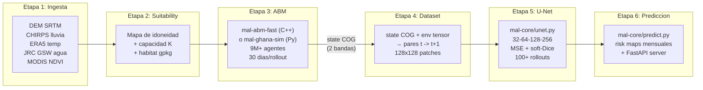

**Flujo de datos**: El ABM (etapa 3) genera state COGs mensuales → el dataset builder (etapa 4) los convierte en pares de entrenamiento → la U-Net (etapa 5) aprende a predecir el siguiente paso → la prediccion (etapa 6) produce risk maps para el programa de eliminacion.

**Relacion ABM ↔ U-Net**: El ABM es el "profesor" (lento, preciso, agente-por-agente). La U-Net es el "estudiante" (rapido, aproximado, prediccion 100x mas veloz). La U-Net entrena con datos del ABM y luego reemplaza al ABM en produccion.

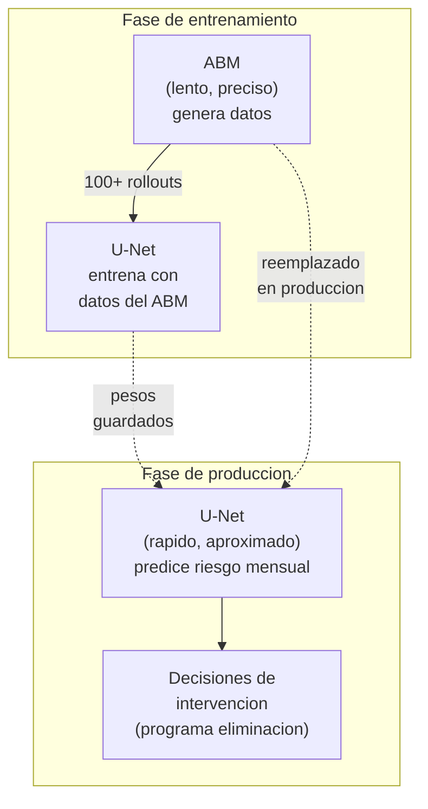

---

## 2. Monorepo — Paquetes activos

```
MalariaSentinel/
  mal-commonlib/          # Base compartida: config, paths, loaders de datos
  mal-core/               # Logica estable del pipeline (U-Net, SDSS, API)
  mal-execution/          # CLI batch, scripts CESGA/Hetzner
  mal-abm-fast/           # ABM en C++20 (motor de alto rendimiento)
  mal-data-explorer/      # Visualizacion de datasets, analisis de sesgo
  agents/                 # Infraestructura de agentes, memoria, loops
  mal-ghana-sim/          # [DEPRECATED] Experimento original
  data/                   # Datasets (gitignored raw data)
  papers/                 # Papers de investigacion
  terrain/                # DEM SRTM tiles
  runs/                   # Salidas de experimentos (gitignored)
```

**Regla de dependencias**: Nada depende de los paquetes de experimentos. Cuando un experimento se estabiliza, se promueve a `mal-core` o `mal-commonlib`.

### Diagrama de dependencias

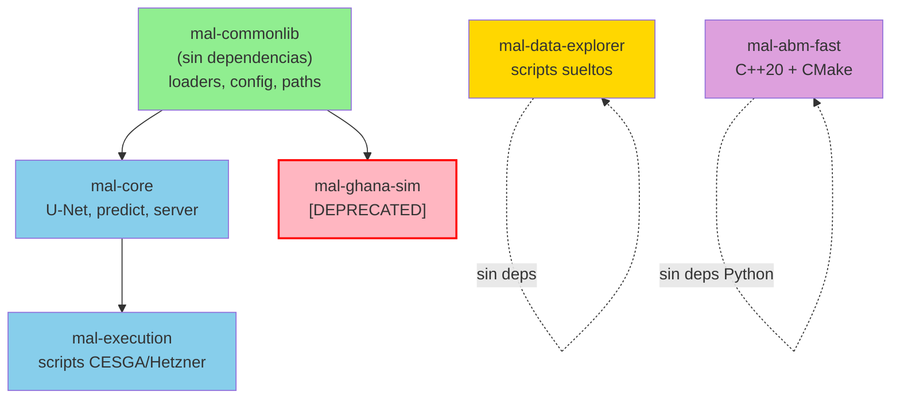

**Reglas de importacion**:
- `mal-core` solo puede importar de `mal-commonlib`
- `mal-execution` puede importar de `mal-core` y `mal-commonlib`
- Los paquetes deprecated (`mal-ghana-sim`) no deben ser importados por paquetes activos
- `mal-abm-fast` es independiente (C++ puro, sin imports Python)

---

## 3. mal-commonlib — Base compartida

**Ubicacion**: `mal-commonlib/src/mal_commonlib/`
**Dependencias**: Ninguna (es la fundacion)

### Modulos

| Modulo | Funcion |
|---|---|
| `aoi.py` | Definiciones de Area of Interest (bbox, CRS, escala) |
| `config.py` | Configuracion compartida (paths, RUNS_DIR) |
| `data/loaders/chirps.py` | Cargador CHIRPS (precipitacion) |
| `data/loaders/dem.py` | Cargador MERIT DEM (elevacion) |
| `data/loaders/era5.py` | Cargador ERA5-Land (reanalisis) |
| `data/loaders/jrc_gsw.py` | Cargador JRC Global Surface Water |
| `data/loaders/modis.py` | Cargador MODIS NDVI (MOD13A3) |
| `data/loaders/worldcover.py` | Cargador ESA WorldCover (uso de suelo) |
| `data/loaders/buildings.py` | Cargador Overture Maps Buildings (building_fraction, M7) |
| `data/loaders/worldpop.py` | Cargador WorldPop (densidad poblacional, M7) |
| `data/loaders/glw.py` | Cargador FAO GLW4 (ganado: cattle, goats, sheep, pigs, chickens, M7) |
| `data/loaders/ghsl.py` | Cargador GHS-SMOD (clasificacion urbano/rural, M7) |
| `data/loaders/wildlife.py` | Cargador proxy wildlife (host no-humano/no-ganado, M7) |
| `data/host_utils.py` | Agregacion a grilla ABM + escritura host_static.nc (M7) |
| `data/mobility.py` | Utilidades de movilidad OD (M7) |
| `data/utils.py` | Utilidades de procesamiento de datos |
| `terrain/twi.py` | Topographic Wetness Index |

### Tests

9 test files: `test_aoi.py`, `test_chirps.py`, `test_dem.py`, `test_era5.py`, `test_host_loaders.py`, `test_jrc_gsw.py`, `test_modis.py`, `test_twi.py`, `test_worldcover.py`

---

## 4. mal-core — Logica estable del pipeline

**Ubicacion**: `mal-core/src/mal_core/`
**Dependencias**: mal-commonlib, torch, fastapi, typer, pydantic, pyyaml
**CLI**: `malariasim` (entry point)

### Arquitectura interna

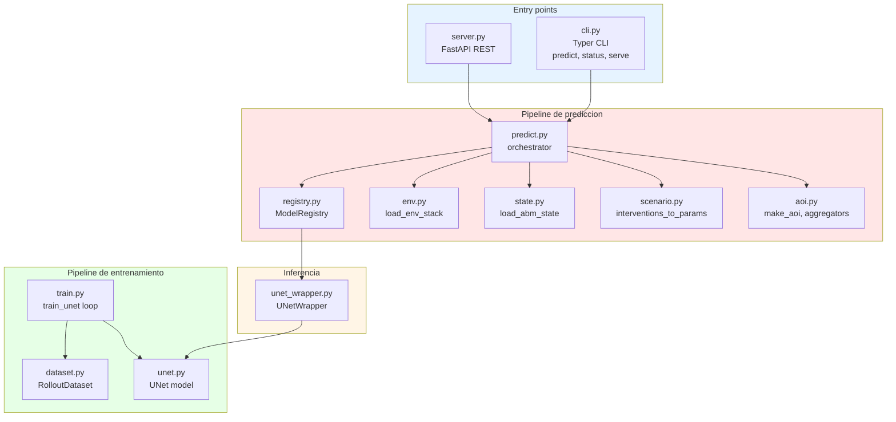

### Modulos

| Modulo | Funcion | Estado |
|---|---|---|
| `cli.py` | CLI Typer: `predict`, `status`, `serve` | Implementado |
| `unet.py` | U-Net 4 bloques down/up, 32-64-128-256, MSE + soft-Dice | Implementado |
| `unet_wrapper.py` | Wrapper de inferencia U-Net | Implementado |
| `train.py` | Loop de entrenamiento U-Net (Adam, val Dice) | Implementado |
| `dataset.py` | Dataset builder: pares (state_t + env) → state_{t+1} | Implementado |
| `predict.py` | Pipeline de prediccion: load model → inference → GeoTIFF | Implementado |
| `env.py` | Carga de env stack (4 canales: water_frac, rain, temp, ndvi) | Implementado |
| `state.py` | Carga de estado ABM desde COGs | Implementado |
| `registry.py` | Registro de modelos (model.yaml manifests) | Implementado |
| `scenario.py` | Schema YAML de escenarios (intervenciones + clima) | Implementado |
| `server.py` | FastAPI: `/predict`, `/aoi/{name}/risk`, `/aoi/{name}/status` | Implementado |
| `aoi.py` | AOI + aggregators (promoted desde commonlib) | Implementado |

### U-Net Arquitectura

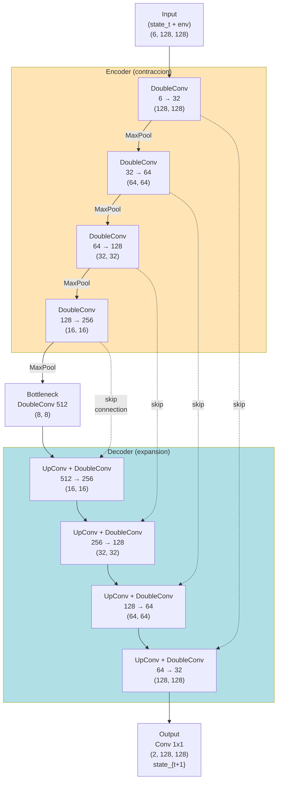

```
Input: (state_t + env) = (6, 128, 128)  →  Target: state_{t+1} = (2, 128, 128)
4 bloques down/up: 32 → 64 → 128 → 256 → bottleneck(512)
BatchNorm + ReLU, skip connections (concat)
Loss: MSE + 0.5 × soft-Dice
```

### CLI

```bash
# Prediccion
malariasim predict --aoi ghana --scale regional --year 2026 --month 6 --model best_model

# Estado
malariasim status --aoi ghana

# Servidor
malariasim serve --host 127.0.0.1 --port 8000
```

### Como mal-core se conecta con el ABM

mal-core consume la salida del ABM (state COGs) para entrenar la U-Net y generar predicciones:

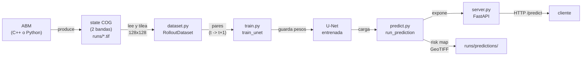

**Flujo paso a paso**:
1. **ABM** (C++ o Python) produce state COGs mensuales en `runs/`
2. **mal-core/dataset.py** lee los COGs y construye pares de entrenamiento (state_t → state_{t+1})
3. **mal-core/train.py** entrena la U-Net con esos pares
4. **mal-core/predict.py** carga la U-Net entrenada y genera risk maps
5. **mal-core/server.py** expone la prediccion via REST API

---

## 5. mal-execution — CLI batch y scripts

**Ubicacion**: `mal-execution/scripts/`
**Dependencias**: mal-core, mal-commonlib
**Estado**: Scripts operacionales, no es un paquete Python empaquetado

### Scripts CESGA (HPC)

| Script | Funcion |
|---|---|
| `cesga-run/cesga_config.sh` | Configuracion del cluster CESGA FT3 |
| `cesga-run/manage_jobs.sh` | Gestion de jobs SLURM |
| `cesga-run/prepare_data.sh` | Preparacion de datos en el cluster |
| `cesga-run/run_abm.sh` | Ejecucion del ABM en el cluster |
| `cesga-run/setup_env.sh` | Setup del entorno en el cluster |

### Scripts Hetzner (Cloud)

| Script | Funcion |
|---|---|
| `hetzner-run/cloud-init.yaml` | Cloud-init para VMs Hetzner |
| `hetzner-run/hetzner-run` | Script de ejecucion en cloud |
| `hetzner-run/lib/common.sh` | Utilidades compartidas |
| `hetzner-run/lib/jobs.sh` | Gestion de jobs |
| `hetzner-run/lib/sync.sh` | Sincronizacion de datos |
| `hetzner-run/lib/vm.sh` | Gestion de VMs |

### Scripts de entrenamiento

| Script | Funcion |
|---|---|
| `train_unet.py` | Entrenamiento U-Net (batch) |
| `train_unet_subsample.py` | Entrenamiento con subsampling |
| `validate_unet.py` | Validacion U-Net |

### Como mal-execution orquesta el ABM

mal-execution es la capa de orquestacion para ejecutar el ABM en escenarios reales (HPC o cloud):

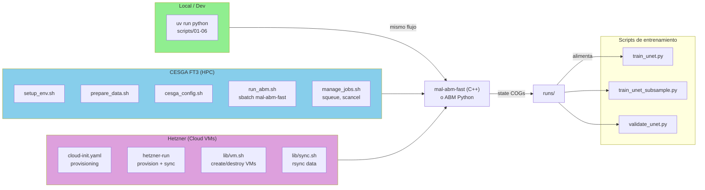

**Flujo en CESGA (HPC)**:
1. `cesga-run/run_abm.sh` invoca `mal_abm_fast run` (C++) o el Python ABM
2. `prepare_data.sh` descarga y prepara los env COGs y habitat gpkg
3. `manage_jobs.sh` gestiona multiples jobs SLURM para rollouts paralelos
4. Los resultados se sincronizan de vuelta con `sync.sh`

---

## 6. mal-abm-fast — Motor ABM en C++

**Ubicacion**: `mal-abm-fast/`
**Estado**: M7.2 **in progress** — F1 complete (60/60 ctest + 5/5 parity), M7 biology v2 actively developing
**Objetivo**: 100 rollouts en <5 min wall en un nodo FT3 ilk

### Que es?

Re-implementacion en C++20 del ABM Python reference (`mal-ghana-sim/abm/`). El motor es **black-box equivalente**: dados los mismos inputs (env, habitat, seed, days), produce los mismos state COGs que el Python.

### Diagrama de modulos y flujo de datos

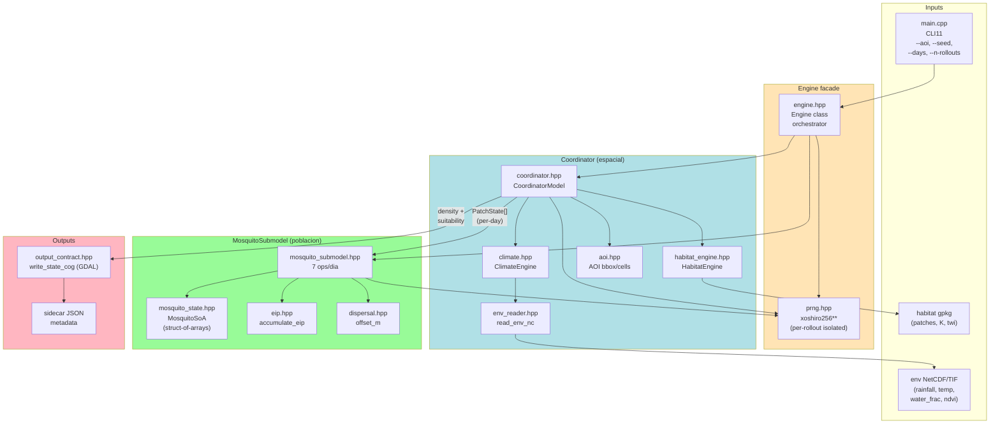

### Componentes C++

| Header | Funcion |
|---|---|
| `wire.hpp` | Tipos de datos compartidos + constantes (K_MAX, EIP, contract v2.0) |
| `aoi.hpp` | Area of Interest (bbox, cells_per_side, transform) |
| `prng.hpp` | PRNG xoshiro256** (determinista, por-rollout aislado) |
| `eip.hpp` | EIP: accumulate_eip (grado-dias, NaN-safe) |
| `dispersal.hpp` | Dispersacion de adultos (kernel Gaussiano, clip) |
| `climate.hpp` | ClimateEngine (lector NetCDF/TIF, lookups por dia) |
| `env_reader.hpp` | Lector de env NetCDF4 (rainfall, temp, water_frac, ndvi) |
| `habitat_engine.hpp` | HabitatEngine (lector gpkg, materialise patches) |
| `coordinator.hpp` | CoordinatorModel (activacion, dynamic patches, densidad) |
| `mosquito_state.hpp` | MosquitoSoA (struct-of-arrays, poblacion + sex + aquatic_stage + gonotrophic) |
| `mosquito_submodel.hpp` | MosquitoSubmodel (lifecycle completo: aquatic + adult + gonotrophic + host-seeking) |
| `engine.hpp` | Engine facade (orchestration, incluye HostLandscape + MobilitySchedule) |
| `output_contract.hpp` | Escritura COG + sidecar JSON (GDAL, contract v2.0) |
| `seeding.hpp` | Seeding modes (UNIFORM, RANDOM_VIABLE, EXPLICIT) |
| `aquatic_stages.hpp` | Enums: AquaticStage (EGG/LARVA/PUPA), AdultSex (MALE/FEMALE) |
| `aquatic_cohort_bank.hpp` | Cohort-based ciclo acuatico (egg→larva L1-L4→pupa→adult) |
| `thermal_responses.hpp` | Curvas termicas por estadio (Briere-1 eggs/pupae, quadratic larvae) |
| `gonotrophic_cycle.hpp` | Maquina de estados gonotrofica (11 estados, HostType) |
| `host_seeking.hpp` | Kernel espacial host-seeking (CO2 plume, 35m scale, anthropophilic) |
| `host_landscape.hpp` | Lector host_static.nc (9 variables: human, cattle, goats, sheep, etc.) |
| `bite_ledger.hpp` | Agregador de eventos de picadura por celda/dia/host |
| `mobility_schedule.hpp` | Matrices OD sparse (CSR) + schedule 4 fases (DAY/EVENING/NIGHT/DAWN) |
| `multirate_scheduler.hpp` | Scheduler multirate: 12 sub-pasos nocturnos (18:00-06:00) para host-seeking |
| `birth_rate.hpp` | Tasa de nacimiento termica (Mordecai 2013 EFD, reemplaza fecundity constante) |
| `grid_spec.hpp` | Validacion espacial multi-capa (CRS, transform, resolucion) |

### Constantes del motor C++ (actualizadas en M7.2)

| Constante | Valor C++ | Valor Python | Notas |
|---|---|---|---|
| `K_MAX` | 1000 | 1000 | Iguales |
| `INIT_FRAC` | 0.30 | 0.30 | Iguales |
| `EIP_BASE_C` | 16.0 | 16.0 | Iguales |
| `EIP_THRESHOLD_GD` | 110.0 | 110.0 | Iguales |
| `ADULT_DISPERSE_PROB` | **0.05** | 0.20 | C++ 5% (calibrado M7, Costantini+Thomas) |
| `ADULT_DISPERSE_SIGMA_M` | **450.0** | 1000.0 | C++ sigma=450m (Costantini 1996 midpoint) |
| `ADULT_DISPERSE_MAX_M` | **2000.0** | 2000.0 | C++ cap 2km (Thomas 2013 95th pctl) |
| `BIRTH_FECUNDITY` | **0.25** | 0.005 (xK) | C++: 25% adultos/2 (calibrado M7) |
| `BIRTH_RATE` | **Mordecai EFD** | constante | C++: termica (T0=16, Tm=34, Topt=25) |
| `PLUVIAL_POOL_RAIN_THRESHOLD_MM` | **15.0** | 15.0 | Iguales (50mm revertido, biologico) |
| `LARVA_BH_S0` | 0.95 | — | Mortalidad Beverton-Holt |
| `LARVA_BH_ALPHA` | 0.05 | — | Coeficiente competencia |
| `ADULT_DAILY_MORT_BASAL` | **0.93** | — | Mortalidad basal (Saarman 2019, Midega 2007) |
| `ADULT_OPT_C` | **25.0** | — | Temperatura optima (Mordecai 2013) |
| `ADULT_SIGMA` | **15.0** | — | Ancho respuesta termica (Martens 1997) |
| `ADULT_MORT_CAP` | 0.93 | — | Upper bound supervivencia (Midega 2007) |
| `ADULT_MORT_FLOOR` | 0.60 | — | Floor mortalidad extremos |
| `ADULT_TEMP_FALLBACK_C` | 25.0 | — | Temp fallback NaN pixels |
| `CONTRACT_VERSION` | **"2.0"** | — | Band rename: adult_occupancy + host_seeking_pressure |
| `GENERATOR_VERSION` | **"m7.1-m7.2-multiscale"** | — | — |
| `LARVA_DESICCATION_GRACE_DAYS` | 5 | — | Dias gracia desecacion |
| `LARVA_DESICCATION_DAILY_RATE` | 0.10 | — | Tasa desecacion |

**Cambios clave M7 vs F1**: Dispersal mas conservador (5% prob, sigma=450m, cap=2km). Nacimiento reemplazado por Mordecai EFD termico (0.25 fecundity constante + curva cuadratica). Mortalidad adulta recalibrada (basal 0.93, sigma=15, caps). Pluvial pool rain threshold revertido a 15mm (era 50mm en F1). Contract v2.0: bandas renombradas.

### Operaciones diarias del submodel (M7: lifecycle completo)

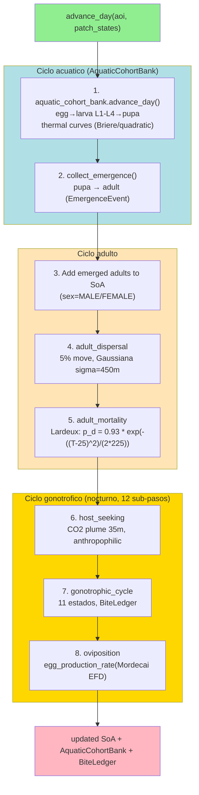

| # | Operacion | Descripcion |
|---|---|---|
| 1 | `aquatic_cohort_bank.advance_day()` | Ciclo acuatico: egg→larva L1-L4→pupa con curvas termicas |
| 2 | `collect_emergence()` | Pupa → adult (EmergenceEvent por parche) |
| 3 | Add emerged adults | Adultos emergidos se agregan a MosquitoSoA (sex aleatorio) |
| 4 | `adult_dispersal` | 5% se mueven (Gaussiana, σ=450m, cap 2000m) |
| 5 | `adult_mortality` | Mortalidad Lardeux thermo-dependent (basal=0.93, sigma=15) |
| 6 | `host_seeking` | Busqueda de hospedador nocturna (CO2 plume 35m, 12 sub-pasos) |
| 7 | `gonotrophic_cycle` | 11 estados (TENERAL→...→OVIPOSITING), BiteLedger |
| 8 | `oviposition` | Deposicion de huevos (Mordecai EFD termica, batch 30-170) |

**Nuevas en M7**: `aquatic_cohort_bank`, `host_seeking`, `gonotrophic_cycle`, `oviposition`. Ciclo acuatico completo (egg→larva→pupa→adult). Busqueda de hospedador nocturna (multirate scheduler). Ciclo gonotrofico de 11 estados.

### Flujo por dia

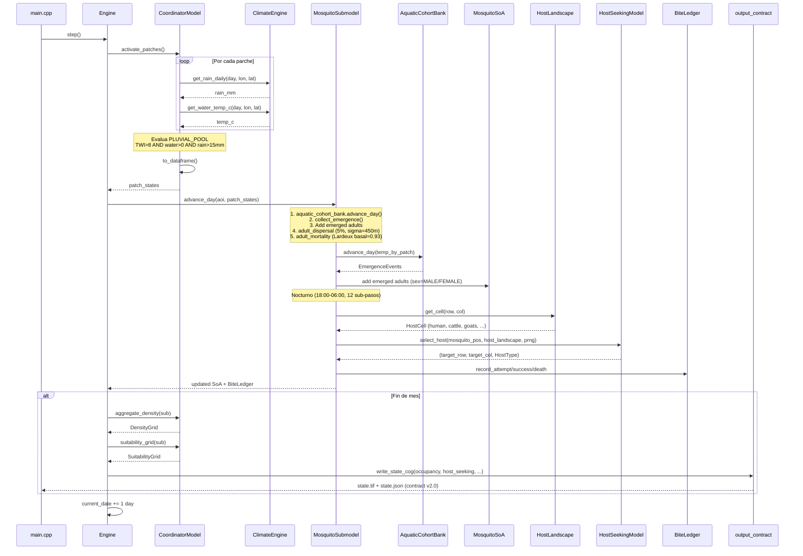

**Flujo por dia (texto)**:

```
1. activate_patches(day)
   → Consulta ClimateEngine → activated = (rain > 15mm)
   → Evalua PLUVIAL_POOL: TWI>8 AND water>0 AND rain>15mm

2. to_dataframe()
   → Materializa todos los parches en vector<PatchState>

3. advance_day(aoi, patch_states)
   → aquatic_cohort_bank.advance_day() (egg→larva L1-L4→pupa, thermal curves)
   → collect_emergence() (pupa → adult, EmergenceEvents)
   → Add emerged adults to SoA (sex aleatorio MALE/FEMALE)
   → adult_dispersal (5%, Gaussiana σ=450m, cap 2000m)
   → adult_mortality (Lardeux basal=0.93, sigma=15)
   → [nocturno] host_seeking (12 sub-pasos, CO2 plume 35m)
   → [nocturno] gonotrophic_cycle (11 estados, BiteLedger)
   → [nocturno] oviposition (Mordecai EFD termica)

4. snapshot(...) (fin de mes)
   → aggregate_density + suitability_grid
   → write_state_cog (2-band COG: adult_occupancy + host_seeking_pressure, contract v2.0)
```

### CLI del motor C++

```bash
# Single rollout
./mal_abm_fast run \
    --aoi ghana --year 2024 --month 6 --seed 1 --days 30 \
    --env data/runs/ghana/ghana_regional_2024_06_env.tif \
    --habitat data/runs/ghana/ghana_regional_2024_06_habitat_patches.gpkg \
    --output data/runs/ghana/ghana_regional_2024_06_state.tif

# 100 rollouts (M-perf target)
./mal_abm_fast run --n-rollouts 100 \
    --aoi ghana --year 2024 --month 6 --seed 1 --days 30 \
    --env data/runs/ghana/ghana_regional_2024_06_env.tif \
    --habitat data/runs/ghana/ghana_regional_2024_06_habitat_patches.gpkg \
    --output /tmp/rollout/state.tif

# Daily snapshots (time-series para U-Net)
./mal_abm_fast run --snapshot-every 1 --n-rollouts 10 \
    --aoi ghana --year 2024 --month 6 --seed 1 --days 30 \
    --env data/runs/ghana/ghana_regional_2024_06_env.tif \
    --habitat data/runs/ghana/ghana_regional_2024_06_habitat_patches.gpkg \
    --output /tmp/rollout/state.tif
```

### CLI flags

| Flag | Default | Descripcion |
|---|---|---|
| `--aoi` | — | AOI slug |
| `--bbox` | — | Custom bbox W,S,E,N |
| `--env` | — | Path a env GeoTIFF/NetCDF |
| `--habitat` | — | Path a habitat GeoPackage |
| `--output` | — | Output path para state COG |
| `--year` | 2024 | Ano de inicio |
| `--month` | 6 | Mes de inicio (1-12) |
| `--seed` | 1 | PRNG seed |
| `--days` | 30 | Dias de simulacion |
| `--n-rollouts` | 1 | Numero de rollouts |
| `--snapshot-every` | 0 | Frecuencia snapshots (0=solo final) |
| `--crs` | EPSG:4326 | CRS del output |
| `--resolution-m` | 1000 | Resolucion metros |
| `--scale` | regional | regional/national/continental |

### Input: Env NetCDF (v2.0)

| Variable | Dimensiones | dtype | Unidades |
|---|---|---|---|
| `rainfall` | (time,y,x) | float32 | mm/day |
| `water_temp_c` | (time,y,x) | float32 | °C |
| `water_frac` | (time,y,x) | float32 | [0,1] |
| `ndvi` | (time,y,x) | float32 | [0,1] |
| `twi` (optional) | (y,x) | float32 | — |

### Output: State COG (v1.1)

- **Band 1**: density (mosquitos / K_MAX ∈ [0,1])
- **Band 2**: suitability (adult density by cell / K_MAX ∈ [0,1])
- **Sidecar JSON**: crs, transform, seed, n_rollouts, rollout_index, contract_version, band_names, k_max, generator_version

### Determinismo

PRNG xoshiro256** canonico. Dos runs con mismo `(seed, i, days, AOI, env, habitat)` producen bytes identicos del COG.

### Seeding modes

| Modo | Descripcion |
|---|---|
| `UNIFORM` | Legacy: init_frac de K en cada parche |
| `RANDOM_VIABLE` | Solo parches viables (water_frac > 0, TWI > 8) |
| `EXPLICIT` | Seed instructions explicitas |

### Tests

```bash
# C++ unit tests (GoogleTest)
ctest --test-dir mal-abm-fast/build --output-on-failure
# 60 tests

# Python parity test (F1.e)
cd mal-ghana-sim && uv run pytest tests/test_abm_fast_parity.py -v
# 5 tests, tolerance: max(2e-2 abs, 12% rel)
```

### Build (macOS)

```bash
brew install cmake ninja pkg-config gdal eigen cli11 nlohmann-json googletest
cmake -S mal-abm-fast -B mal-abm-fast/build -G Ninja \
      -DCMAKE_BUILD_TYPE=Release
cmake --build mal-abm-fast/build -j
ctest --test-dir mal-abm-fast/build --output-on-failure
```

---

## 7. mal-data-explorer — Visualizacion de datasets

**Ubicacion**: `mal-data-explorer/`
**Dependencias**: pandas, matplotlib, geopandas, shapely, cartopy, contextily, pypdf, scipy

### Flujo de trabajo

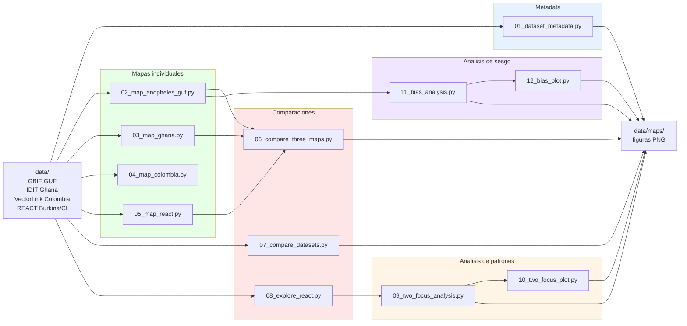

### Scripts

| # | Script | Descripcion |
|---|---|---|
| 01 | `01_dataset_metadata.py` | Auditoria metadata GBIF (GUF) |
| 02 | `02_map_anopheles_guf.py` | Mapa ocurrencias Guayana Francesa |
| 03 | `03_map_ghana.py` | Mapa sitios larvarios IDIT Ghana |
| 04 | `04_map_colombia.py` | Mapa VectorLink Colombia |
| 05 | `05_map_react.py` | Mapa REACT Burkina Faso + Cote d'Ivoire |
| 06 | `06_compare_three_maps.py` | Comparacion 3 datasets |
| 07 | `07_compare_datasets.py` | Comparacion cuantitativa 6 datasets |
| 08 | `08_explore_react.py` | Exploracion dataset REACT |
| 09 | `09_two_focus_analysis.py` | Analisis patron dos focos |
| 10 | `10_two_focus_plot.py` | Visualizacion patron dos focos |
| 11 | `11_bias_analysis.py` | Analisis sesgo dataset GUF |
| 12 | `12_bias_plot.py` | Visualizaciones sesgo |

### Conexion con el ABM

Independiente del ABM. Analiza datasets de ocurrencia de Anopheles para entender distribucion geografica, identificar sesgos, y validar que el ABM genera mosquitos en zonas correctas.

---

## 8. agents/ — Infraestructura de agentes

### Arquitectura de loops

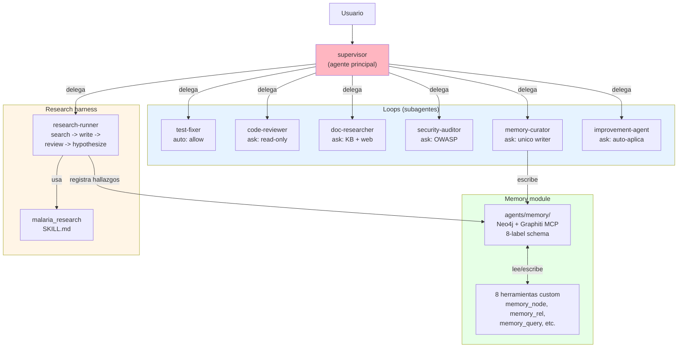

### Loops

| Agente | Funcion | Permisos |
|---|---|---|
| `test-fixer` | Itera verificacion hasta exit 0 | allow (auto) |
| `code-reviewer` | Revisa diffs (solo lectura) | ask |
| `doc-researcher` | Busca en KB, luego web | ask |
| `security-auditor` | Auditoria OWASP (solo lectura) | ask |
| `memory-curator` | Unico writer al knowledge graph | ask |
| `improvement-agent` | Revisa + aplica mejoras | ask |

### Memory module

- Neo4j + Graphiti MCP docker stack
- Schema 8 labels: Component, Investigation, Architecture, Pattern, Pitfall, Tool, Operational, Preference
- 8 herramientas custom: memory_audit, memory_init, memory_node, memory_query, memory_recall, memory_rel, memory_seed, memory_status

### Research harness

Pipeline para ciclos de investigacion: search → write → review → hypothesize.

---

## 9. Ciclo de vida del mosquito (ABM)

### Estados y transiciones (M7: ciclo completo)

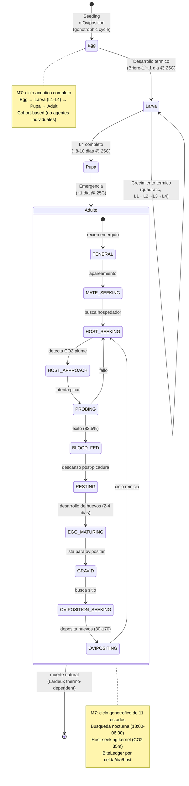

```
[*] → Egg: Seeding o Oviposition (batch 30-170)
Egg → Larva: Desarrollo termico (Briere-1, ~1 dia @ 25°C)
Larva → Larva: Mortalidad Beverton-Holt, crecimiento termico (L1→L2→L3→L4)
Larva → Pupa: L4 completo (~8-10 dias @ 25°C)
Pupa → Adult: Emergencia (~1 dia @ 25°C)

Adult (gonotrophic cycle, 11 estados):
  TENERAL → MATE_SEEKING → HOST_SEEKING → HOST_APPROACH → PROBING
  → BLOOD_FED → RESTING → EGG_MATURING → GRAVID
  → OVIPOSITION_SEEKING → OVIPOSITING → HOST_SEEKING (repite)

Adult → [*]: muerte natural (Lardeux basal=0.93, sigma=15)
```

### Componentes nuevos M7

| Componente | Funcion |
|---|---|
| `AquaticCohortBank` | Ciclo acuatico cohort-based (egg→larva L1-L4→pupa→adult) |
| `GonotrophicState` | 11 estados gonotroficos (TENERAL→...→OVIPOSITING) |
| `HostSeekingModel` | Kernel espacial host-seeking (CO2 plume 35m, anthropophilic 99%) |
| `HostLandscape` | Lector host_static.nc (9 variables: human, cattle, goats, sheep, pigs, chickens, wildlife, building, indoor) |
| `BiteLedger` | Agregador de eventos de picadura por celda/dia/host |
| `MobilitySchedule` | Matrices OD sparse (CSR) + schedule 4 fases (DAY/EVENING/NIGHT/DAWN) |
| `MultirateScheduler` | 12 sub-pasos nocturnos (18:00-06:00) para host-seeking |
| `ThermalResponses` | Curvas termicas Briere-1 (eggs/pupae) y quadratic (larvae) |
| `BirthRate` | Mordecai EFD termica (reemplaza fecundity constante) |

### Simplificaciones (estado actual)

- **Implementado en M7**: ciclo acuatico completo (egg→larva→pupa→adult), ciclo gonotrofico (11 estados), busqueda de hospedador (CO2 plume), mortalidad termica (Lardeux recalibrado), nacimiento termico (Mordecai EFD), movilidad humana/ganado (OD matrices), host data (9 variables)
- **Pendiente (M7+)**: infeccion Plasmodium (parasite_eip_progress ya en SoA), ITN/IRS (bite_ledger tiene campo mosquito_deaths preparado)
- **Pendiente (M8+)**: 1 sola especie An. gambiae s.s.

---

## 10. Contrato de salida

### Diagrama de produccion de archivos

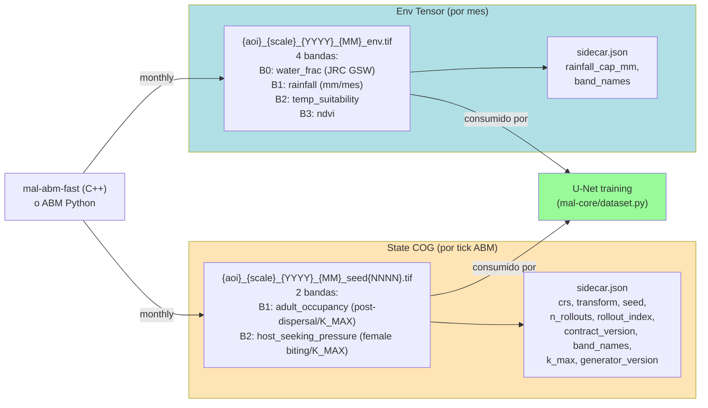

### State COG (contract v2.0)

- **Band 1**: adult_occupancy (total adult mosquito occupancy in cell, post-dispersal / K_MAX, [0,1])
- **Band 2**: host_seeking_pressure (female host-seeking/biting pressure in cell / K_MAX, [0,1])
- **Sidecar JSON**: crs, transform, seed, contract_version (2.0), band_names, k_max, generator_version (m7.1-m7.2-multiscale)

### Env Tensor

- **Band 0**: water_frac [0,1] (JRC GSW 30m)
- **Band 1**: rainfall mm/mes crudos
- **Band 2**: temp_suitability [0,1] (Mordecai)
- **Band 3**: ndvi [0,1]

---

## 11. Milestones

| Milestone | Nombre | Estado |
|---|---|---|
| M0 | Casablanca (reaction-diffusion) | Completado (reemplazado) |
| M1 | ABM Thin Slice | Completado |
| M2 | Validacion datos reales | Completado |
| M-perf F1 | C++ ABM Engine | Completado |
| M3 | U-Net Training | Pendiente |
| M4 | U-Net Inference | Pendiente |
| M5 | SDSS Shell | Pendiente |
| M6 | Operational | Pendiente |
| M7 | Biology v2 | **En progreso** (M7.2: gonotrophic cycle, host-seeking, mobility, host data) |

---

## 12. M7 vs. futuro (M8+)

| Componente | M7 (actual) | M8+ |
|---|---|---|
| Especies | 1: An. gambiae s.s. | + An. stephensi |
| Habitat | PLUVIAL_POOL + dynamic | 12 subtipos Hardy |
| Etapas vida | 4: egg→larva L1-L4→pupa→adult (cohort-based) | — |
| Ciclo gonotrofico | 11 estados (TENERAL→...→OVIPOSITING) | Validacion campo |
| EIP | grado-dia (16°C, 110 GD) + thermal curves (Briere/quadratic) | + Sharpe-DeMichele |
| Dispersion | Gaussiana (5%, σ=450m, cap 2km) | + Eolica 120-290m |
| Busqueda hospedador | CO2 plume 35m, 12 nocturnal sub-steps | + olor, calor |
| Host data | 9 variables (human, cattle, goats, sheep, pigs, chickens, wildlife, building, indoor) | — |
| Mobility | Sparse OD matrices (CSR), 4 time phases | — |
| Resistencia kdr | No | alleles Vgsc |
| Mortalidad adulta | Lardeux basal=0.93, sigma=15, caps | Validacion datos |
| Mortalidad larvaria | Beverton-Holt + thermal (Briere/quadratic) | — |
| Birth rate | Mordecai EFD termica (T0=16, Tm=34, Topt=25) | — |
| Infeccion Plasmodium | No (parasite_eip_progress en SoA, preparado) | M8+ |
| ITN/IRS | No (BiteLedger mosquito_deaths preparado) | M8+ |
| Poblacion | SoA + AquaticCohortBank | + mesa-frames |
| Validacion | 14 calibration scorers (D1-D14) + parity | 100+ rollouts |
| Contract | v2.0 (adult_occupancy + host_seeking_pressure) | — |

---

## 13. Resumen ejecutivo

### Lo que funciona hoy

**ABM Python (v0.5.0)**: 71/71 tests, ~9M agentes Polars, JRC GSW 30m, dynamic patches, adult density by cell post-dispersal, ciclo biologico completo.

**ABM C++ (mal-abm-fast M7.2)**: 60+ ctest + 5/5 parity + 14 calibration scorers (D1-D14), C++20 black-box equivalente, ciclo completo egg→larva→pupa→adult (cohort-based), ciclo gonotrofico 11 estados, host-seeking kernel (CO2 plume 35m), host data 9 variables, mobility OD matrices (CSR, 4 fases), Mortalidad Lardeux recalibrada (basal=0.93, sigma=15), nacimiento Mordecai EFD termico, PRNG xoshiro256** determinista, contract v2.0.

**Host data pipeline (M7)**: WorldPop (poblacion), GLW4 (ganado), GHSL (urbano/rural), Overture Maps (building_fraction), wildlife proxy. Todo agrega a host_static.nc (9 variables). Mobility matrices via gravity model (build_mobility.py).

**Pipeline SDSS (mal-core)**: U-Net 32-64-128-256, CLI `malariasim`, FastAPI REST API, model registry, scenario config.

### Siguientes pasos

1. **M7 completar**: Infeccion Plasmodium (parasite_eip_progress preparado), ITN/IRS (BiteLedger preparado), validacion 100+ rollouts
2. **M3**: Generar 100+ rollouts con mal-abm-fast → dataset → entrenar surrogate
3. **M4**: Integrar prediccion → risk maps mensuales
4. **M5**: Interfaz SDSS para programas de eliminacion
5. **M6**: Deployment en Ghana con datos en vivo
6. **M8**: An. stephensi, resistencia kdr, Sharpe-DeMichele EIP
